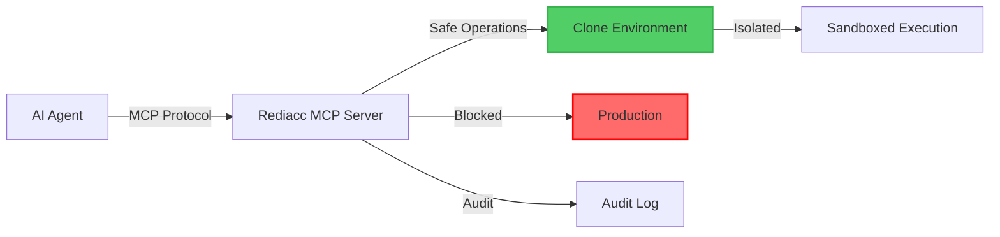

# MCP (Model Context Protocol) Integration

The Model Context Protocol (MCP) is an open standard that enables AI assistants to safely interact with external systems. Rediacc provides comprehensive MCP support, allowing AI agents to work with your infrastructure while maintaining absolute production safety.

## Overview

MCP integration with Rediacc enables:
- **Safe AI Operations**: AI agents work exclusively on clones
- **Controlled Access**: Hard permission boundaries that cannot be overridden
- **Complete Audit Trail**: Every AI action logged and reversible
- **Resource Limits**: CPU, memory, and data transfer restrictions
- **Native Integration**: Works with Claude, GPT, and any MCP-compatible system

## Architecture



## Installation

### 1. Install Rediacc MCP Server

```bash
# Via npm (recommended)
npm install -g @rediacc/mcp-server

# Via Docker
docker pull rediacc/mcp-server:latest

# Verify installation
rediacc-mcp-server --version
```

### 2. Initial Configuration

```bash
# Interactive setup
rediacc-mcp-server init

# Or configure directly
rediacc-mcp-server configure \
  --api-url=https://www.rediacc.com \
  --api-token=your-token \
  --safety-mode=maximum \
  --auto-sandbox=true
```

## Configuration

### Basic Configuration

Create `mcp-config.json`:

```json
{
  "server": {
    "type": "stdio",
    "command": "rediacc-mcp-server",
    "args": ["--config", "/path/to/config.json"]
  },
  "rediacc": {
    "api": {
      "url": "https://www.rediacc.com",
      "token": "${REDIACC_API_TOKEN}"
    },
    "safety": {
      "mode": "maximum",
      "auto_clone": true,
      "production_access": "denied",
      "sandbox_only": true
    },
    "limits": {
      "max_clones": 5,
      "clone_lifespan": "1h",
      "max_data_transfer": "200MB",
      "max_operations": 1000
    },
    "monitoring": {
      "audit_all": true,
      "alert_on_anomaly": true,
      "real_time_logs": true
    }
  }
}
```

### Advanced Configuration

```json
{
  "rediacc": {
    "safety": {
      "mode": "custom",
      "rules": [
        {
          "pattern": "DELETE|DROP|TRUNCATE",
          "action": "redirect_to_clone",
          "alert": true
        },
        {
          "pattern": "production|prod",
          "action": "deny",
          "message": "Production access denied for AI agents"
        }
      ]
    },
    "cloning": {
      "auto_create": true,
      "naming_pattern": "ai-sandbox-{timestamp}",
      "cleanup": {
        "enabled": true,
        "after": "1h",
        "on_error": "preserve_for_debugging"
      }
    },
    "permissions": {
      "allowed_operations": [
        "create_clone",
        "query_clone",
        "modify_clone",
        "delete_clone",
        "read_metrics",
        "read_logs"
      ],
      "denied_operations": [
        "access_production",
        "modify_credentials",
        "change_permissions",
        "disable_audit"
      ]
    }
  }
}
```

## Integration with AI Systems

### Claude Integration

#### 1. Configure Claude Desktop

Edit `~/.claude/settings.json`:

```json
{
  "mcpServers": {
    "rediacc": {
      "type": "stdio",
      "command": "rediacc-mcp-server",
      "args": [
        "--mode=safe",
        "--auto-clone",
        "--audit-all"
      ],
      "env": {
        "REDIACC_API_TOKEN": "your-token-here",
        "REDIACC_SAFETY": "enforced",
        "PRODUCTION_ACCESS": "denied"
      }
    }
  }
}
```

#### 2. Available Tools for Claude

Once configured, Claude can use these tools:

```typescript
// List available environments
await mcp.use_tool("rediacc", "list_environments", {});

// Create a sandbox clone
await mcp.use_tool("rediacc", "create_sandbox", {
  source: "production",
  purpose: "testing database migration",
  lifespan: "2h"
});

// Execute safe operations
await mcp.use_tool("rediacc", "execute_safe", {
  environment: "ai-sandbox-001",
  command: "DROP TABLE test_data",  // Only affects clone
  timeout: 30
});

// Query data safely
await mcp.use_tool("rediacc", "query_data", {
  environment: "ai-sandbox-001",
  query: "SELECT COUNT(*) FROM users",
  limit: 1000
});

// Time travel restore
await mcp.use_tool("rediacc", "restore_snapshot", {
  environment: "staging",
  timestamp: "2024-08-03T10:00:00Z",
  preview: true
});
```

### GPT/OpenAI Integration

```python
# openai-rediacc-config.py
import openai
from rediacc_mcp import RediaccMCP

# Initialize MCP connection
mcp = RediaccMCP(
    api_token="your-token",
    safety_mode="maximum",
    auto_sandbox=True
)

# Register tools with OpenAI
tools = [
    {
        "type": "function",
        "function": {
            "name": "create_safe_environment",
            "description": "Create a sandboxed clone for testing",
            "parameters": {
                "type": "object",
                "properties": {
                    "source": {"type": "string"},
                    "purpose": {"type": "string"}
                }
            }
        }
    }
]

# Use in conversation
response = openai.ChatCompletion.create(
    model="gpt-4",
    messages=messages,
    tools=tools,
    tool_choice="auto"
)
```

### Custom AI Agent Integration

```javascript
// custom-ai-integration.js
const { RediaccMCP } = require('@rediacc/mcp-client');

class SafeAIAgent {
  constructor() {
    this.mcp = new RediaccMCP({
      apiToken: process.env.REDIACC_TOKEN,
      safety: {
        autoClone: true,
        productionAccess: 'denied',
        maxDataTransfer: '200MB'
      }
    });
  }

  async performDatabaseOperation(operation) {
    // Automatically creates clone
    const sandbox = await this.mcp.createSandbox({
      source: 'production',
      lifespan: '1h'
    });

    try {
      // AI can do anything here - it's just a clone
      const result = await this.mcp.execute({
        environment: sandbox.id,
        command: operation
      });
      
      return result;
    } finally {
      // Cleanup
      await this.mcp.deleteSandbox(sandbox.id);
    }
  }
}
```

## MCP Tools Reference

### Core Tools

#### `list_environments`
List available environments for AI operations.

```json
{
  "name": "list_environments",
  "parameters": {
    "type": "all|production|staging|sandbox",
    "include_clones": true
  }
}
```

#### `create_sandbox`
Create an instant clone for safe AI operations.

```json
{
  "name": "create_sandbox",
  "parameters": {
    "source": "production|staging|development",
    "purpose": "description of intended use",
    "lifespan": "1h|2h|1d|1w",
    "restrictions": "none|read_only|limited"
  }
}
```

#### `execute_safe`
Execute commands in sandboxed environment.

```json
{
  "name": "execute_safe",
  "parameters": {
    "environment": "sandbox-id",
    "command": "any command or query",
    "timeout": 30,
    "capture_output": true
  }
}
```

#### `query_data`
Safely query data from any environment.

```json
{
  "name": "query_data",
  "parameters": {
    "environment": "environment-name",
    "query": "SELECT * FROM table",
    "limit": 1000,
    "format": "json|csv|table"
  }
}
```

#### `restore_snapshot`
Restore environment to previous state.

```json
{
  "name": "restore_snapshot",
  "parameters": {
    "environment": "environment-name",
    "timestamp": "ISO-8601 datetime",
    "preview": true,
    "create_backup": true
  }
}
```

### Monitoring Tools

#### `get_audit_log`
Retrieve audit log of AI operations.

```json
{
  "name": "get_audit_log",
  "parameters": {
    "agent_id": "ai-agent-001",
    "time_range": "1h|1d|1w",
    "include_blocked": true,
    "format": "detailed|summary"
  }
}
```

#### `check_status`
Check status of environments and operations.

```json
{
  "name": "check_status",
  "parameters": {
    "environment": "environment-name",
    "include_metrics": true,
    "include_health": true
  }
}
```

## Safety Features

### Automatic Sandboxing

All potentially dangerous operations are automatically redirected to sandboxes:

```javascript
// AI attempts to delete data
await mcp.execute({
  command: "DROP TABLE users"  // Automatically redirected to sandbox
});

// Behind the scenes:
// 1. Rediacc detects destructive operation
// 2. Creates instant clone
// 3. Executes on clone
// 4. Production remains untouched
```

### Permission Boundaries

Hard limits that AI cannot override:

```yaml
permission_boundaries:
  never_allowed:
    - access: production_write
    - operation: delete_permanent
    - action: disable_audit
    - privilege: modify_permissions
  
  requires_human:
    - operation: production_deployment
    - action: credential_rotation
    - privilege: security_changes
```

### Real-Time Monitoring

```javascript
// Set up monitoring
const monitor = mcp.monitor({
  alerts: {
    dataTransfer: { threshold: '200MB', action: 'block' },
    deletionRate: { threshold: '10/min', action: 'suspend' },
    anomaly: { sensitivity: 'high', action: 'alert' }
  },
  notifications: {
    email: 'admin@company.com',
    slack: '#security-alerts',
    webhook: 'https://api.company.com/alerts'
  }
});

// Monitor will automatically:
// - Block excessive data transfer
// - Suspend agent on rapid deletions
// - Alert on unusual patterns
```

### Audit Trail

Every operation is logged with full context:

```json
{
  "timestamp": "2024-08-03T15:30:45Z",
  "agent_id": "claude-001",
  "operation": "DROP TABLE",
  "environment": "ai-sandbox-xyz",
  "status": "executed_on_clone",
  "production_impact": "none",
  "details": {
    "original_target": "production",
    "redirected_to": "clone",
    "safety_rule": "destructive_operation"
  }
}
```

## Best Practices

### 1. Start with Maximum Safety

```json
{
  "safety": {
    "mode": "maximum",
    "auto_clone": true,
    "production_access": "denied"
  }
}
```

Relax restrictions only after thorough testing.

### 2. Use Purpose-Specific Sandboxes

```javascript
// Good: Clear purpose
const sandbox = await mcp.createSandbox({
  source: "production",
  purpose: "testing user migration script v2.1",
  lifespan: "2h"
});

// Bad: Vague purpose
const sandbox = await mcp.createSandbox({
  source: "production",
  purpose: "testing",
  lifespan: "1w"
});
```

### 3. Implement Progressive Permissions

```javascript
// Start minimal
const aiPermissions = {
  level1: ["read_logs", "query_metrics"],
  level2: ["create_sandbox", "query_sandbox"],
  level3: ["modify_sandbox", "run_tests"],
  never: ["production_write", "disable_audit"]
};
```

### 4. Regular Safety Drills

```bash
# Weekly safety test
rediacc-mcp-server test \
  --simulate-breach \
  --verify-protection \
  --generate-report
```

## Troubleshooting

### Common Issues

#### MCP Server Not Starting

```bash
# Check logs
rediacc-mcp-server logs --tail 50

# Verify configuration
rediacc-mcp-server validate-config

# Test connection
rediacc-mcp-server test-connection
```

#### AI Cannot Access Resources

```bash
# Check permissions
rediacc-mcp-server permissions --agent ai-001

# Verify sandbox creation
rediacc-mcp-server list-sandboxes --active

# Review audit log
rediacc-mcp-server audit --agent ai-001 --last 1h
```

#### Performance Issues

```bash
# Check resource usage
rediacc-mcp-server stats

# Optimize configuration
rediacc-mcp-server optimize --auto

# Clean up old sandboxes
rediacc-mcp-server cleanup --older-than 24h
```

## Advanced Topics

### Custom Safety Rules

```javascript
// custom-rules.js
module.exports = {
  rules: [
    {
      name: "prevent_mass_deletion",
      pattern: /DELETE.*WHERE\s+1\s*=\s*1/i,
      action: "deny",
      message: "Mass deletion detected and blocked"
    },
    {
      name: "redirect_drops",
      pattern: /DROP\s+(TABLE|DATABASE)/i,
      action: "redirect_to_sandbox",
      alert: true
    },
    {
      name: "monitor_exports",
      pattern: /SELECT.*INTO\s+OUTFILE/i,
      action: "monitor",
      threshold: "100MB"
    }
  ]
};
```

### Webhook Integration

```javascript
// webhook-config.js
{
  webhooks: {
    onSandboxCreate: "https://api.company.com/sandbox/created",
    onAnomalyDetected: "https://api.company.com/security/anomaly",
    onThresholdExceeded: "https://api.company.com/alerts/threshold",
    onAuditEvent: "https://api.company.com/audit/log"
  }
}
```

### Multi-Agent Coordination

```javascript
// Coordinate multiple AI agents safely
const coordinator = new RediaccMCP.Coordinator({
  agents: ["claude-001", "gpt-001", "custom-001"],
  sharedSandbox: true,
  isolationLevel: "high",
  conflictResolution: "queue"
});

await coordinator.execute(async (sandbox) => {
  // All agents work on same sandbox
  // Operations are queued to prevent conflicts
  // Isolation ensures no interference
});
```

## Monitoring Dashboard

Access the MCP monitoring dashboard:

```bash
# Start dashboard
rediacc-mcp-server dashboard --port 8080

# Access at http://localhost:8080
```

Dashboard features:
- Real-time AI operation monitoring
- Sandbox lifecycle tracking
- Audit log visualization
- Alert management
- Performance metrics
- Safety rule configuration

## Compliance and Security

### SOC 2 Compliance
- Complete audit trail of all AI operations
- Automatic data isolation
- Access control enforcement
- Regular security assessments

### GDPR Compliance
- Data remains in designated regions
- Right to erasure maintained
- AI cannot access PII without authorization
- Full transparency of AI operations

### HIPAA Compliance
- PHI isolation in separate environments
- Audit logs for all access
- Encryption at rest and in transit
- Access limited to authorized purposes

## Support and Resources

### Documentation
- [MCP Protocol Specification](https://modelcontextprotocol.org)
- [Rediacc API Reference](/cli/api-reference)
- [AI Safety Best Practices](/solutions/ai-safety)
- [Audit System Guide](/docs/console-guide/audit)

### Community
- GitHub: [github.com/rediacc/mcp-server](https://github.com/rediacc/mcp-server)
- Discord: [discord.gg/rediacc](https://discord.gg/rediacc)
- Forum: [forum.rediacc.io/mcp](https://forum.rediacc.io/mcp)

### Support
- Email: mcp-support@rediacc.io
- Documentation: [docs.rediacc.io/mcp](https://docs.rediacc.io/mcp)
- Enterprise Support: [rediacc.io/enterprise](https://rediacc.io/enterprise)

## Summary

MCP integration with Rediacc provides the safest possible environment for AI operations. By ensuring AI agents work exclusively on clones, implementing hard permission boundaries, and maintaining complete audit trails, Rediacc makes AI-induced production disasters impossible.

The integration is simple to set up, works with all major AI systems, and provides peace of mind that no matter what an AI agent attempts, your production data remains safe and untouchable.