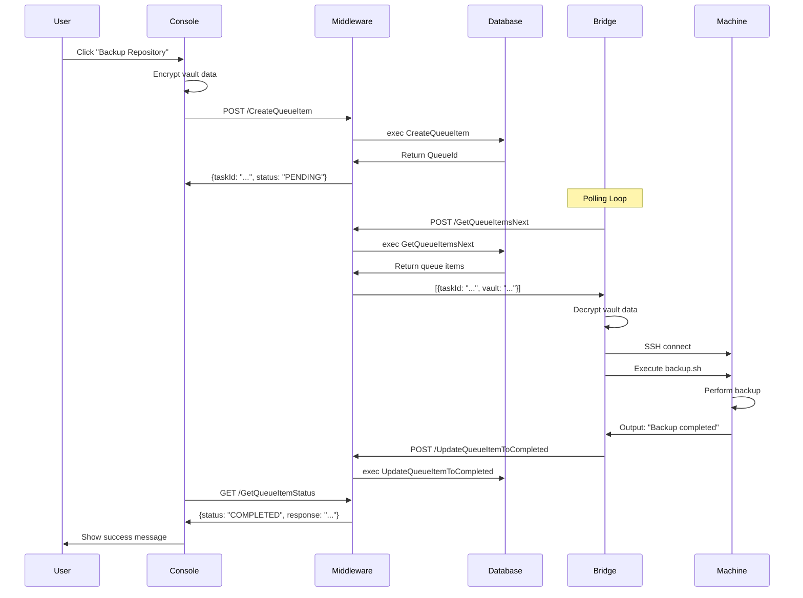
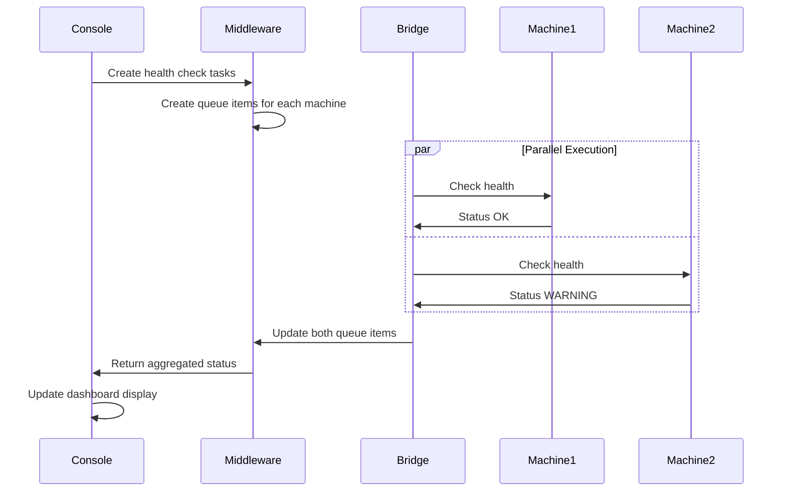

# System Architecture

The Rediacc Console is part of a comprehensive distributed system designed for secure, scalable task execution across remote infrastructure. This document provides detailed technical information about the system architecture, communication protocols, and implementation details.

## Overview

The Rediacc system follows a layered architecture with five main components that communicate in a specific flow:

```
Console (Web UI) ←→ Middleware (API) ←→ Bridge (Queue Processor) ←→ Machine (Remote Servers)
                 ↑                    ↑
                 └────── CLI ─────────┘
```

## Component Deep Dive

### 1. Console (Web UI)

**Technology Stack**: React with TypeScript  
**Location**: `/console`  
**Purpose**: Web-based user interface for system management

**Key Components**:
- **API Client** (`src/api/client.ts`): Handles all middleware communication
- **Encryption Middleware** (`src/api/encryptionMiddleware.ts`): Client-side vault encryption/decryption
- **State Management**: Redux for application state
- **UI Framework**: Ant Design component library

**Communication**:
- HTTP/HTTPS REST API to Middleware
- Automatic token rotation for security
- Client-side encryption of sensitive data

### 2. Middleware (API Server)

**Technology Stack**: C# .NET Core  
**Location**: `/middleware`  
**Purpose**: Central API server managing business logic and database operations

**Key Components**:
- **Stored Procedure Controller** (`Service/StoredProcedureController.cs`): Main API endpoint handler
- **Database Scripts** (`scripts/db_middleware_*.sql`): SQL Server stored procedures
- **Authentication System**: Token-based with rotation
- **Authorization Framework**: Role-based access control

**Database Architecture**:
- SQL Server with stored procedures
- Whitelisted procedure execution
- Parameter sanitization for security

### 3. Bridge (Queue Processor)

**Technology Stack**: C++ with libssh  
**Location**: `/bridge`  
**Purpose**: Autonomous queue processor executing tasks on remote machines

**Key Components**:
- **Main Entry** (`cli/src/main.cpp`): Bridge mode initialization
- **Queue Processor** (`cli/include/queue_processor.hpp`): Core processing logic
- **Execution Scripts** (`cli/scripts/*.sh`): Bash scripts for operations
- **SSH Integration**: libssh for secure connections

**Operation Mode**:
```bash
./bridge --bridge-mode token=<api_token> api_url=<url> master_password=<pwd> batch_size=3
```

### 4. Machine (Remote Servers)

**Type**: Linux servers accessed via SSH  
**Purpose**: Actual compute resources where tasks execute

**Requirements**:
- SSH access enabled
- Authorized keys configured
- Docker support (optional)
- Sufficient storage for operations

### 5. CLI (Command Line Interface)

**Technology Stack**: Python with platform-specific wrappers  
**Location**: `/cli`  
**Purpose**: Direct system interaction via command line

**Components**:
- **Main CLI** (`rediacc`): API operations
- **Sync Tool** (`rediacc-sync`): File synchronization via rsync
- **Terminal Access** (`rediacc-term`): Interactive SSH sessions
- **Core Module** (`rediacc_cli_core.py`): Shared functionality

## Communication Protocols

### Console → Middleware Protocol

**Type**: HTTP/HTTPS REST API

**Authentication Headers**:
```http
Rediacc-RequestToken: <current-token>
```

**Token Rotation**:
Each response includes the next token:
```json
{
  "data": { ... },
  "nextRequestToken": "new-token-here"
}
```

**API Endpoint Format**:
```
POST /api/StoredProcedure/{procedureName}
Content-Type: application/json

{
  "parameter1": "value1",
  "parameter2": "value2"
}
```

**Example Request**:
```typescript
const response = await apiClient.post('/CreateQueueItem', {
  teamName: 'Default',
  machineName: 'server-01',
  bridgeName: 'bridge-01',
  queueVault: encryptedVaultData,
  priority: 1
});
```

### Middleware → Database Protocol

**Type**: SQL Server Stored Procedures

**Security Model**:
```csharp
// From StoredProcedureController.cs
private static readonly Dictionary<string, ProcedureConfig> WhitelistedProcedures = new()
{
    ["CreateAuthenticationRequest"] = new(true, ProcedurePrefix.Public),
    ["CreateQueueItem"] = new(true, ProcedurePrefix.Public),
    ["GetQueueItemsNext"] = new(true, ProcedurePrefix.Protected),
    // ... more procedures
};
```

**Procedure Categories**:

1. **Authentication Procedures**:
   - `CreateAuthenticationRequest`
   - `ActivateUserAccount`
   - `ValidateUserToken`

2. **Queue Management**:
   - `CreateQueueItem`
   - `GetQueueItemsNext`
   - `UpdateQueueItemResponse`
   - `UpdateQueueItemToCompleted`

3. **Resource Management**:
   - `CreateMachine`
   - `CreateBridge`
   - `CreateTeam`
   - `CreateRepository`

### Bridge → Middleware Protocol

**Type**: HTTP API in polling mode

**Queue Processing Flow**:

1. **Poll for Tasks**:
   ```http
   POST /api/StoredProcedure/GetQueueItemsNext
   {
     "bridgeName": "bridge-01",
     "batchSize": 3
   }
   ```

2. **Update Progress**:
   ```http
   POST /api/StoredProcedure/UpdateQueueItemResponse
   {
     "taskId": "550e8400-e29b-41d4-a716-446655440000",
     "response": "Processing step 1 of 5..."
   }
   ```

3. **Complete Task**:
   ```http
   POST /api/StoredProcedure/UpdateQueueItemToCompleted
   {
     "taskId": "550e8400-e29b-41d4-a716-446655440000",
     "status": "COMPLETED",
     "finalResponse": "Task completed successfully"
   }
   ```

### Bridge → Machine Protocol

**Type**: SSH using libssh

**Authentication Flow**:
1. Decrypt vault data to retrieve SSH credentials
2. Extract private key from team vault
3. Get machine details (IP, user, datastore path)
4. Establish SSH connection
5. Execute bash scripts
6. Capture output and errors

**Execution Example**:
```cpp
// Pseudo-code from bridge implementation
auto credentials = decryptVault(queueItem.vaultData, masterPassword);
auto sshKey = credentials["SSH_PRIVATE_KEY"];
auto machineIp = credentials["machine"]["ip"];
auto sshUser = credentials["machine"]["user"];

SSHSession session(machineIp, sshUser, sshKey);
auto result = session.execute("/path/to/script.sh");
```

## Core Systems

### Queue System Architecture

**Database Schema**:
```sql
CREATE TABLE Queue (
    QueueId INT PRIMARY KEY IDENTITY,
    TaskId UNIQUEIDENTIFIER NOT NULL,
    Status VARCHAR(20) NOT NULL,
    Priority INT NOT NULL,
    TeamName VARCHAR(100),
    MachineName VARCHAR(100),
    BridgeName VARCHAR(100),
    QueueVault NVARCHAR(MAX),
    Response NVARCHAR(MAX),
    RetryCount INT DEFAULT 0,
    CreatedDate DATETIME,
    UpdatedDate DATETIME
);
```

**Status Lifecycle**:
```
PENDING → ASSIGNED → PROCESSING → COMPLETED
                  ↓            ↓
                  └─→ FAILED ←─┘
                  ↓
                  CANCELLED
```

**Priority Levels**:
- 1: Highest (immediate execution)
- 2: High (prioritized)
- 3: Normal (default)
- 4: Low (background tasks)
- 5: Lowest (batch operations)

### Vault System Design

**Encryption Format**:
```
encrypted:<base64_encoded_data>
```

**Vault Types and Contents**:

1. **Company Vault**:
   ```json
   {
     "companySettings": {
       "maxUsers": 100,
       "features": ["backup", "monitoring"],
       "licenseKey": "encrypted:..."
     }
   }
   ```

2. **Team Vault**:
   ```json
   {
     "SSH_PRIVATE_KEY": "encrypted:...",
     "DEFAULT_USER": "deploy",
     "TEAM_SETTINGS": {
       "backupRetention": 30,
       "maxMachines": 50
     }
   }
   ```

3. **Machine Vault**:
   ```json
   {
     "ip": "10.0.0.5",
     "user": "deploy",
     "datastore": "/mnt/datastore",
     "dockerSupport": true
   }
   ```

4. **Queue Vault**:
   ```json
   {
     "function": "backup",
     "repository": "main-app",
     "parameters": {
       "destination": "s3://backups/",
       "retention": 30
     }
   }
   ```

### Authentication & Security

**Token Structure**:
```json
{
  "userId": "user@example.com",
  "permissions": ["Administrators"],
  "issuedAt": "2023-01-01T00:00:00Z",
  "expiresAt": "2023-01-02T00:00:00Z",
  "tokenId": "unique-token-id"
}
```

**Security Features**:
- Automatic token rotation on each request
- IP address validation
- Request rate limiting
- Comprehensive audit logging
- Master password encryption (PBKDF2)
- Field-level encryption for sensitive data

## Data Flow Examples

### Example 1: Repository Backup Task



### Example 2: Machine Health Check



## Performance Optimization

### Bridge Optimization
- **Batch Processing**: Configure batch size (1-10) based on workload
- **Connection Pooling**: Reuse SSH connections when possible
- **Parallel Execution**: Process multiple queue items simultaneously
- **Retry Logic**: Automatic retry with exponential backoff

### API Optimization
- **Stored Procedures**: Minimize database roundtrips
- **Token Caching**: Reduce authentication overhead
- **Response Compression**: GZIP for large payloads
- **Connection Pooling**: Database connection reuse

### Console Optimization
- **Lazy Loading**: Load data on demand
- **Virtual Scrolling**: Handle large datasets efficiently
- **State Management**: Minimize re-renders
- **API Batching**: Combine multiple requests

## Deployment Patterns

### Single Region Deployment
```
┌─────────────┐
│   Console   │
└──────┬──────┘
       │ HTTPS
┌──────┴──────┐     ┌────────────┐
│ Middleware  │────►│  Database  │
└──────┬──────┘     └────────────┘
       │
┌──────┴──────┐     ┌────────────┐
│   Bridge    │────►│  Machines  │
└─────────────┘ SSH └────────────┘
```

### Multi-Region Deployment
```
                 ┌─────────────┐
                 │   Console   │
                 └──────┬──────┘
                        │
                 ┌──────┴──────┐
                 │ Middleware  │
                 └──────┬──────┘
                        │
        ┌───────────────┼───────────────┐
        │               │               │
┌───────┴─────┐ ┌───────┴─────┐ ┌──────┴──────┐
│ US Bridge   │ │ EU Bridge   │ │ Asia Bridge │
└──────┬──────┘ └──────┬──────┘ └──────┬─────┘
       │               │               │
┌──────┴──────┐ ┌──────┴──────┐ ┌──────┴─────┐
│ US Machines │ │ EU Machines │ │Asia Machines│
└─────────────┘ └─────────────┘ └─────────────┘
```

## Troubleshooting Guide

### Common Issues

**Token Expired**:
- Console auto-redirects to login
- CLI prompts for re-authentication
- Bridge logs authentication failure

**Queue Item Stuck**:
- Check bridge logs for errors
- Verify machine connectivity
- Review retry count in database
- Manual intervention via Console

**SSH Connection Failed**:
- Verify machine vault credentials
- Check network connectivity
- Validate SSH key permissions
- Review firewall rules

**Vault Decryption Error**:
- Ensure correct master password
- Check for vault version mismatch
- Verify encryption format
- Review audit logs

### Debug Mode

Enable verbose logging:
```bash
# Bridge debug mode
REDIACC_VERBOSE=1 ./bridge --bridge-mode ...

# CLI debug mode
./rediacc --debug list machines

# Console debug mode
localStorage.setItem('debug', 'rediacc:*');
```

## Security Considerations

### Defense in Depth
1. **Network Security**: HTTPS, SSH, firewall rules
2. **Authentication**: Multi-factor, token rotation
3. **Authorization**: Role-based, team isolation
4. **Encryption**: At-rest and in-transit
5. **Audit**: Comprehensive logging

### Best Practices
- Regular security audits
- Principle of least privilege
- Network segmentation
- Regular key rotation
- Monitoring and alerting

## Future Architecture Considerations

### Planned Enhancements
- WebSocket support for real-time updates
- GraphQL API alongside REST
- Kubernetes operator for Bridge
- Multi-cloud abstraction layer
- Advanced queue routing algorithms

### Scalability Roadmap
- Horizontal Bridge scaling
- Database sharding
- CDN for Console assets
- Message queue integration
- Microservices architecture