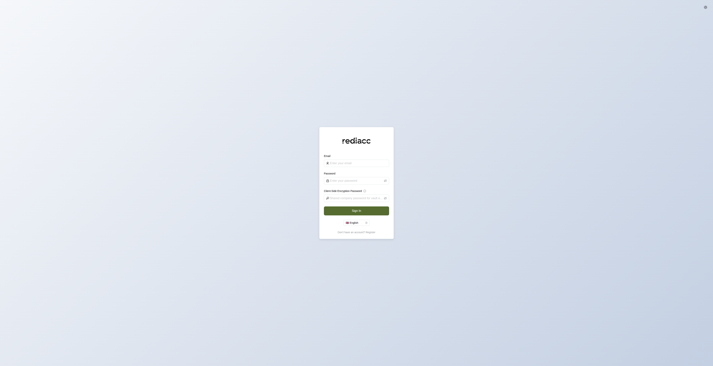
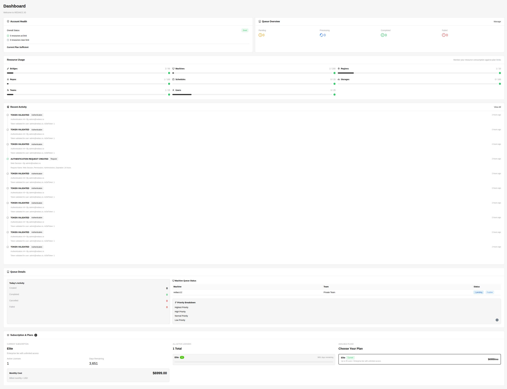
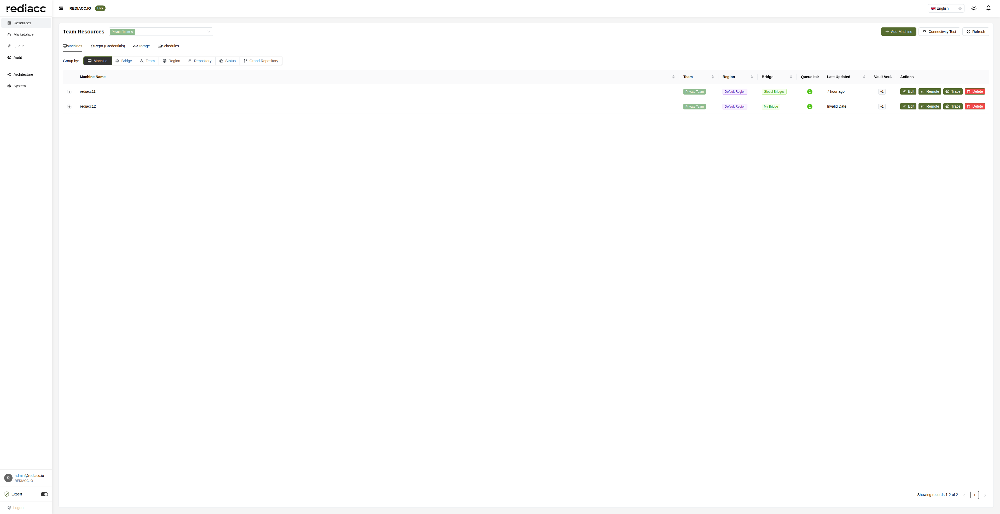
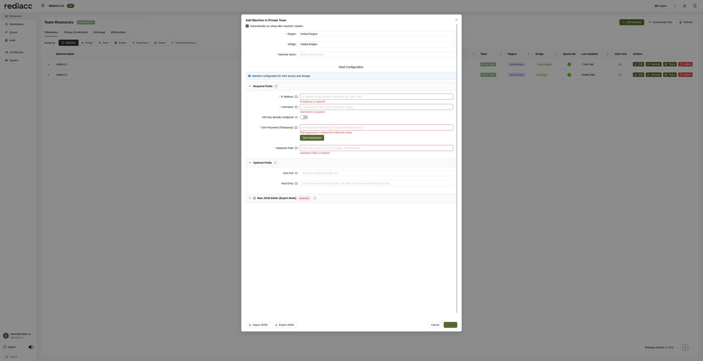
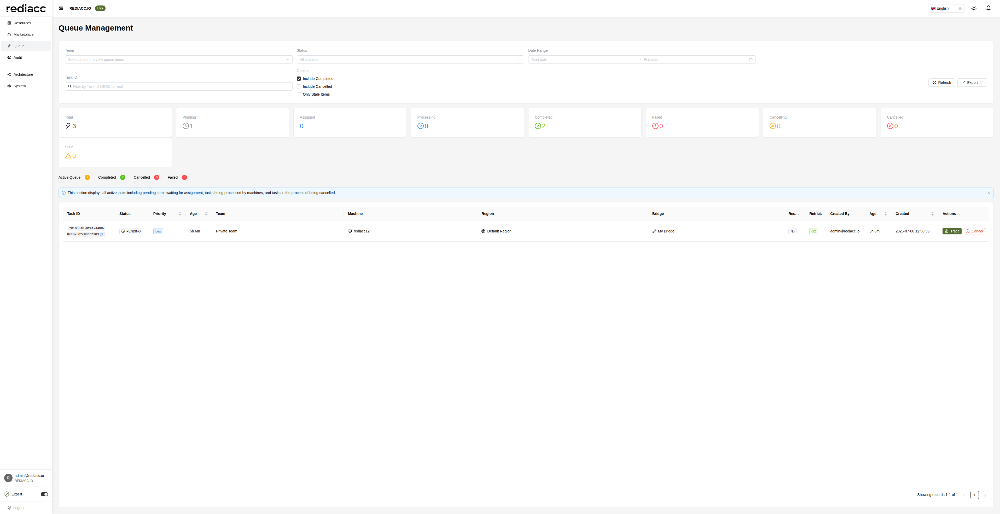
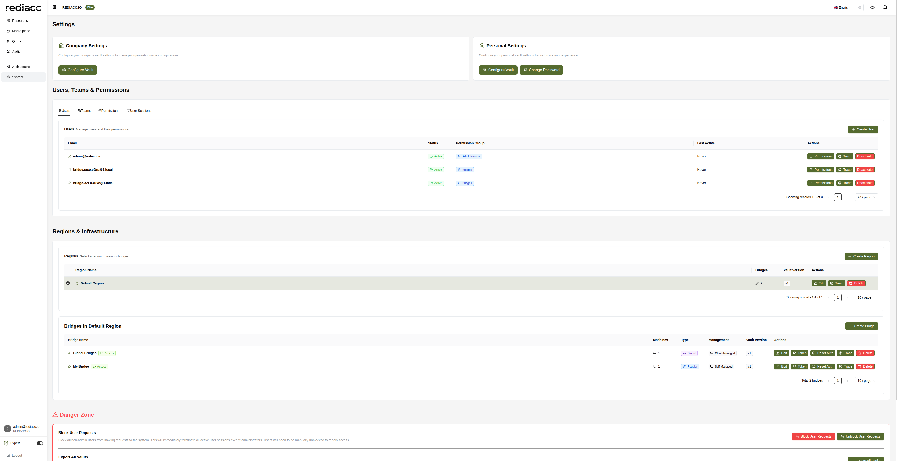

# User Workflows

This guide walks you through common workflows in the Rediacc Console, from initial setup to daily operations. Each workflow includes step-by-step instructions with visual references to help you accomplish tasks efficiently.

## Getting Started Workflow

### 1. Initial Login
1. Navigate to your Console URL (e.g., `http://localhost:7322/console-guide/`)
2. Enter your credentials:
   - **Email**: Your registered email address
   - **Password**: Your account password
   - **Client-Side Encryption Password**: If enabled by your organization
3. Click **Sign In**

### 2. Dashboard Orientation
After login, familiarize yourself with the dashboard:
- **Account Health**: Top-left widget showing system status
- **Queue Overview**: Top-right widget with task statistics
- **Resource Usage**: Center grid displaying resource utilization
- **Recent Activity**: Bottom-left feed of system events

## Infrastructure Management Workflow

### Setting Up a New Machine

#### Step 1: Navigate to Resources
1. Click **Resources** in the sidebar
2. Select your team from the dropdown (e.g., "Private Team")
3. The Machines tab is selected by default

#### Step 2: Add Machine Configuration
1. Click **Add Machine** button
2. Fill in the required fields:
   - **Region**: Select from dropdown (e.g., "Default Region")
   - **Bridge**: Choose the bridge for task processing
   - **Machine Name**: Enter a unique identifier

#### Step 3: Configure SSH Access
In the Vault Configuration section:
1. Enter **IP Address** of your server
2. Specify **Username** for SSH access
3. If SSH key is not configured:
   - Keep "SSH key already configured" toggle OFF
   - Enter temporary SSH password for initial key setup
4. Click **Test Connection** to verify access
5. Enter **Datastore Path** (e.g., `/mnt/datastore`)

#### Step 4: Optional Settings
Expand "Optional Fields" if needed:
- **SSH Port**: Change from default 22 if required
- **Host Entry**: Add custom host entries

#### Step 5: Complete Setup
1. Review all settings
2. Click **Create** to add the machine
3. If "Automatically run setup" was checked, the system will configure SSH keys

### Managing Existing Machines

#### Viewing Machine Details
From the Resources page:
- **Expand Row**: Click the arrow to see detailed information
- **Queue Items**: Badge shows active tasks on the machine
- **Last Updated**: Shows when configuration was last modified
- **Vault Version**: Tracks configuration version history

#### Machine Actions
- **Edit**: Modify machine configuration
- **Remote**: Access machine via SSH
- **Trace**: View audit history for the machine
- **Delete**: Remove machine (requires confirmation)

## Queue Management Workflow

### Monitoring Queue Status

#### Step 1: Access Queue Management
1. Click **Queue** in the sidebar
2. View the statistics bar showing task distribution

#### Step 2: Filter Queue Items
Use the filter controls:
- **Team**: Select specific team or "All teams"
- **Status**: Filter by task status (All, Pending, Processing, etc.)
- **Date Range**: Set start and end dates
- **Task ID**: Search by specific GUID

#### Step 3: View Queue Tabs
Navigate between tabs to focus on:
- **Active Queue**: Currently processing and pending items
- **Completed**: Successfully finished tasks
- **Cancelled**: Manually terminated tasks
- **Failed**: Tasks that encountered errors

### Managing Queue Items

#### Understanding Queue Item Details
Each row shows:
- **Task ID**: Unique identifier with copy button
- **Status**: Visual indicator (⚠️ Stale, 🕐 Pending, etc.)
- **Priority**: Low, Normal, High, or Highest
- **Machine/Bridge**: Assigned resources
- **Retries**: Current attempt count
- **Age**: Time since creation

#### Queue Actions
- **Trace**: View detailed execution history
- **Cancel**: Terminate pending or processing tasks

## Team and User Management Workflow

### Setting Up a New Team

#### Step 1: Navigate to System Settings
1. Click **System** in the sidebar
2. Click on the **Teams** tab

#### Step 2: Create Team
1. Click **Create Team** button
2. Enter team details:
   - **Team Name**: Unique identifier
   - **Description**: Optional team description
3. Configure team vault for shared credentials
4. Click **Create**

### Managing Users

#### Step 1: View Users
1. In System settings, stay on the **Users** tab
2. View the list of all users with their:
   - Status (Active/Inactive)
   - Permission Group
   - Last Active time

#### Step 2: Create New User
1. Click **Create User** button
2. Fill in user details:
   - **Email**: User's email address
   - **Permission Group**: Select from available groups
   - **Teams**: Assign to one or more teams
3. Click **Create** to send invitation

#### Step 3: Manage User Permissions
For existing users:
1. Click **Permissions** button next to the user
2. Modify permission group assignment
3. Add or remove team memberships
4. Save changes

## Daily Operations Workflow

### Morning Health Check

1. **Dashboard Review** (2 minutes)
   - Check Account Health widget for overall status
   - Review Queue Overview for any stale or failed items
   - Scan Resource Usage for items near limits

2. **Queue Inspection** (3 minutes)
   - Navigate to Queue page
   - Check Active Queue tab for stuck items
   - Review Failed tab for overnight failures
   - Note any items requiring manual intervention

3. **Activity Review** (2 minutes)
   - Check Recent Activity on dashboard
   - Look for unusual authentication patterns
   - Note any configuration changes

### Responding to Alerts

#### High Queue Backlog
1. Check Queue page for pending count
2. Verify bridges are online and processing
3. Consider adding temporary bridges if needed
4. Adjust task priorities if necessary

#### Resource Limits Approaching
1. Review Resource Usage grid on dashboard
2. Identify which resources are near limits
3. Options:
   - Clean up unused resources
   - Request limit increase
   - Upgrade subscription plan

#### Failed Tasks
1. Navigate to Queue → Failed tab
2. Click on failed task to view details
3. Check error messages and logs
4. Options:
   - Fix underlying issue and retry
   - Cancel if no longer needed
   - Escalate to team lead

## Advanced Workflows

### Bulk Operations

#### Exporting Queue Data
1. Navigate to Queue page
2. Apply desired filters
3. Click **Export** dropdown
4. Select format:
   - **CSV**: For spreadsheet analysis
   - **JSON**: For programmatic processing
   - **PDF**: For reports

#### Connectivity Testing
1. Go to Resources → Machines
2. Select multiple machines (checkbox)
3. Click **Connectivity Test**
4. Review results for any failures

### Audit and Compliance

#### Generating Audit Reports
1. Click **Audit** in sidebar
2. Set date range for report period
3. Filter by:
   - Entity type
   - User
   - Action type
4. Click **Export** for compliance records

#### Reviewing User Activity
1. Navigate to System → User Sessions tab
2. View active sessions and locations
3. Check for suspicious access patterns
4. Terminate sessions if needed

## Best Practices

### Security Workflows
- **Regular Password Updates**: System → Personal Settings → Change Password
- **Vault Rotation**: Periodically update machine credentials
- **Session Management**: Log out when leaving workstation

### Performance Optimization
- **Queue Priority**: Assign appropriate priorities to balance load
- **Resource Grouping**: Use the grouping feature in Resources for better organization
- **Batch Operations**: Process similar tasks together

### Troubleshooting Workflow

1. **Identify Issue**
   - Check dashboard alerts
   - Review error messages
   - Note affected resources

2. **Gather Information**
   - Export relevant queue items
   - Check audit logs
   - Review machine connectivity

3. **Resolution Steps**
   - Test connectivity
   - Verify credentials
   - Check bridge status
   - Retry failed operations

4. **Document and Prevent**
   - Update runbooks
   - Adjust monitoring
   - Train team members

## Next Steps

- Explore [Advanced Features](./features-overview.md) for power user capabilities
- Review [API Integration](./api-integration.md) for automation options
- Set up [Desktop Integration](./desktop-integration.md) for enhanced productivity