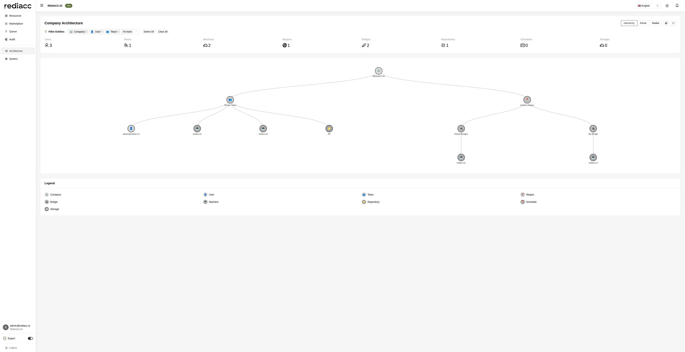

# Architecture Visualization

The Architecture page provides an interactive, real-time visual representation of your entire Rediacc infrastructure. This powerful tool displays all system entities and their relationships in a dynamic, explorable graph format.



## Overview

The architecture visualization is your infrastructure command center, offering:
- **Real-time infrastructure mapping**: See your entire system at a glance
- **Relationship visualization**: Understand how components connect
- **Interactive exploration**: Navigate complex infrastructures easily
- **Multiple view modes**: Choose the best perspective for your needs
- **Advanced filtering**: Focus on what matters most
- **Live updates**: Changes reflect immediately

## Visualization Modes

Toggle between three distinct visualization modes using the radio buttons at the top of the page:

### 1. Hierarchy View (Default)
The hierarchical layout presents your infrastructure as a tree structure:
- **Company (root)**: Your organization sits at the top
- **Primary branches**: Teams and regions extend from the company
- **Secondary branches**: Bridges and resources branch from teams/regions
- **Leaf nodes**: Individual machines, repos, and storage endpoints
- **Benefits**: Clear ownership paths, easy to trace permissions
- **Best for**: Understanding organizational structure and resource ownership

### 2. Force Layout
A physics-based simulation where entities behave like charged particles:
- **Attraction**: Related entities pull together
- **Repulsion**: Unrelated entities push apart
- **Dynamic positioning**: Nodes find optimal positions automatically
- **Interactive**: Drag nodes to reorganize manually
- **Benefits**: Reveals hidden patterns and clusters
- **Best for**: Discovering unexpected relationships and resource groupings

### 3. Radial Layout
Concentric circles radiating from a central point:
- **Center**: Most connected entity (usually company or major team)
- **Inner rings**: Direct connections to the center
- **Outer rings**: Progressively distant relationships
- **Equal spacing**: Nodes arranged evenly around each ring
- **Benefits**: Shows relationship distance clearly
- **Best for**: Understanding dependency chains and connection depth

## Entity Types

Each entity type has a unique icon and color for easy identification:

### Company (🏢)
**The root of your infrastructure**
- Always appears at the top/center of visualizations
- Contains all other entities in your organization
- Shows your company name (e.g., "REDIACC.IO")
- Cannot be filtered out (always visible)
- Single instance per deployment

### Users (👤)
**Individual accounts with system access**
- Display format: email address
- Connected to: Teams (membership), Company (employment)
- Shows in tooltip: Permission groups, last activity
- Common patterns: Users typically connect to 1-3 teams
- Security note: Orphaned users (no team) require investigation

### Teams (👥)
**Organizational units for grouping resources**
- Display format: "Team Name"
- Shows member count in tooltip
- Connected to: Company, Users, Machines, Repositories
- Key relationships: Teams own machines and repos
- Best practice: One team per project or department

### Regions (📍)
**Geographic or logical infrastructure zones**
- Display format: "Region Name"
- Purpose: Latency optimization, compliance, organization
- Connected to: Company, Bridges, Machines
- Common setup: Default Region, US-East, EU-West, etc.
- Infrastructure note: Bridges can be global or regional

### Bridges (🔌)
**Queue processors that execute tasks**
- Display format: "Bridge Name" with machine count
- Types: Global (cloud-managed) or Regional (self-managed)
- Connected to: Regions, Machines
- Shows in tooltip: Processing capacity, management type
- Performance indicator: Machine count shows workload capacity

### Machines (💻)
**Compute resources where tasks execute**
- Display format: "Machine Name"
- Connected to: Teams (ownership), Bridges (processing), Regions (location)
- Dual representation: May appear twice (team view and bridge view)
- Key metric: Active queue items
- Status indicator: Last connection time

### Repositories (📁)
**Code storage and deployment sources**
- Display format: "Repository Name"
- Types: Git, Docker Registry, File Storage
- Connected to: Teams (ownership), Machines (deployment)
- Security: Access controlled via team vault
- Common pattern: One repo per application or service

### Schedules (📅)
**Automated recurring tasks**
- Display format: "Schedule Name"
- Connected to: Teams, Machines (execution target)
- Shows in tooltip: Cron expression, next run time
- Dependency tracking: Can link to other schedules
- Status: Active/Paused indicator

### Storage (☁️)
**External storage endpoints**
- Display format: "Storage Name"
- Types: S3, Azure Blob, GCS, SFTP
- Connected to: Teams (ownership)
- Purpose: Backups, archives, data transfer
- Security: Credentials in team vault

## Filtering System

The advanced filtering system helps you focus on specific parts of your infrastructure:

### Entity Filter Panel
Located on the left side, this multi-select dropdown provides:

**Filter Interface**:
- 🔍 **Search box**: Type to find specific entity types
- **Selected count**: Shows "Company, User, Team +6 more"
- **Dropdown arrow**: Click to expand full list
- **Quick actions**: Select All / Clear All buttons

**Filter Options**:
1. 🏢 Company - The root organization
2. 👤 User - Individual accounts
3. 👥 Team - Organizational units
4. 📍 Region - Geographic zones
5. 🔌 Bridge - Queue processors
6. 💻 Machine - Compute resources
7. 📁 Repository - Code storage
8. 📅 Schedule - Automated tasks
9. ☁️ Storage - External storage

**Filter Behavior**:
- **Real-time updates**: Graph changes instantly
- **Persistent state**: Selections remain during session
- **Relationship preservation**: Shows connections between visible entities
- **Smart filtering**: Orphaned connections are hidden

### Using Filters Effectively

**Common Filter Scenarios**:

1. **Infrastructure Overview**:
   - Select: Company, Team, Region, Bridge
   - Purpose: See organizational structure

2. **Resource Audit**:
   - Select: Machine, Repository, Storage
   - Purpose: Review all compute and storage resources

3. **User Access Review**:
   - Select: User, Team
   - Purpose: Audit user assignments

4. **Deployment Architecture**:
   - Select: Machine, Repository, Bridge
   - Purpose: Understand deployment paths

## Interactive Features

### Node Interactions

Each node in the graph is fully interactive:

**Hover Actions**:
- **Tooltip display**: Shows entity details
  - Type and name
  - Key metrics (member count, machine count)
  - Relationships count
  - Last updated timestamp
- **Connection highlighting**: Related nodes and edges glow
- **Visual feedback**: Node enlarges slightly

**Click Actions**:
- **Select node**: Highlights the entity
- **Focus view**: Centers graph on selected node
- **Show details**: Expanded information panel (if in expert mode)
- **Multi-select**: Ctrl+Click for multiple selections

**Drag Actions**:
- **Reposition**: Move nodes to custom locations
- **Pin position**: Nodes stay where placed
- **Group arrange**: Drag related nodes together
- **Force override**: Manual layout supersedes automatic

### Graph Controls

Control buttons in the top-right corner:

**🔄 Refresh Button**:
- Reloads latest infrastructure data
- Maintains current view and filters
- Updates counters and relationships
- Shows loading indicator during refresh

**⛶ Fullscreen Button**:
- Expands visualization to entire screen
- Hides navigation and headers
- ESC key to exit
- Maintains all interactions in fullscreen

**Navigation Controls**:
- **Zoom In/Out**: Mouse wheel or trackpad pinch
- **Pan**: Click and drag on empty space
- **Fit to Screen**: Double-click background
- **Reset View**: Refresh returns to default zoom

## Entity Count Dashboard

The statistics panel shows real-time infrastructure metrics:

**Count Display Format**:
```
Users        👤 3
Teams        👥 1  
Machines     💻 2
Regions      📍 1
Bridges      🔌 2
Repositories 📁 1
Schedules    📅 0
Storages     ☁️ 0
```

**Count Features**:
- **Live updates**: Counts change as you filter
- **Zero indication**: Grayed out when count is 0
- **Quick reference**: See infrastructure size at a glance
- **Resource planning**: Identify what needs scaling

## Understanding Relationships

### Connection Types

**Direct Connections:**
- Solid lines
- Parent-child relationships
- Ownership links
- Primary associations

**Indirect Connections:**
- Derived relationships
- Transitive connections
- System dependencies
- Cross-references

### Relationship Patterns

**Hub and Spoke:**
- Central entity (team/region)
- Connected resources
- Clear ownership
- Efficient structure

**Mesh Network:**
- Multiple connections
- Redundant paths
- High availability
- Complex dependencies

**Hierarchical Tree:**
- Clear levels
- Defined ownership
- Simple navigation
- Scalable structure

## Use Cases

### 1. Infrastructure Planning
- Visualize current state
- Identify gaps
- Plan expansions
- Balance resources

### 2. Troubleshooting
- Trace dependencies
- Find bottlenecks
- Identify orphans
- Verify connections

### 3. Security Auditing
- Review access paths
- Check isolation
- Verify boundaries
- Audit permissions

### 4. Documentation
- Export visualizations
- Architecture diagrams
- System documentation
- Stakeholder communication

## Performance Tips

### Large Infrastructures
1. Use entity filters
2. Focus on specific areas
3. Collapse unused branches
4. Use search functionality

### Optimization
- Limit visible entities
- Use appropriate layout
- Disable animations if needed
- Regular data refresh

## Advanced Features

### Search Functionality
- Find specific entities
- Highlight search results
- Navigate to entity
- Filter by properties

### Export Options
- SVG for documentation
- PNG for presentations
- JSON for data analysis
- PDF for reports

### Custom Layouts
- Save layout preferences
- Create custom views
- Share configurations
- Template layouts

## Interpreting the Visualization

### Healthy Architecture
- Balanced distribution
- Clear hierarchies
- No orphaned entities
- Logical groupings

### Problem Indicators
- Isolated entities
- Overcrowded nodes
- Missing connections
- Circular dependencies

### Optimization Opportunities
- Underutilized resources
- Imbalanced distribution
- Redundant entities
- Inefficient paths

## Best Practices

### Regular Review
1. Weekly architecture review
2. Check for orphaned resources
3. Verify relationships
4. Plan optimizations

### Documentation
1. Screenshot key views
2. Document changes
3. Note dependencies
4. Share with team

### Planning
1. Model changes first
2. Identify impacts
3. Plan migrations
4. Test scenarios

## Real-World Use Cases

### Scenario 1: Onboarding New Team

**Objective**: Set up infrastructure for a new development team

**Steps**:
1. Filter to show: Company, Team, User
2. Identify existing team structures
3. Plan new team connections
4. Verify no resource conflicts

**What to look for**:
- Existing team patterns
- User distribution
- Available resources
- Naming conventions

### Scenario 2: Troubleshooting Failed Deployments

**Objective**: Find why deployments to specific machines fail

**Steps**:
1. Filter: Machine, Bridge, Repository
2. Locate the problem machine
3. Trace its bridge connection
4. Check repository associations

**Common issues revealed**:
- Machine not connected to bridge
- Bridge overloaded (too many machines)
- Repository not accessible from machine's team
- Regional isolation problems

### Scenario 3: Security Audit

**Objective**: Verify proper access control and isolation

**Steps**:
1. Start with User and Team filter
2. Check for orphaned users
3. Add Machine filter
4. Verify team boundaries

**Security checks**:
- Users without team assignments
- Machines accessible by multiple teams
- Bridges with excessive permissions
- Cross-team repository access

### Scenario 4: Performance Optimization

**Objective**: Balance load across infrastructure

**Steps**:
1. Filter: Bridge, Machine, Region
2. Identify load imbalances
3. Look for geographic clustering
4. Plan redistribution

**Optimization opportunities**:
- Bridges with single machine (underutilized)
- Bridges with 10+ machines (overloaded)
- Regional concentration
- Cross-region dependencies

## Advanced Patterns

### Multi-Region Architecture

**Typical Pattern**:
```
Company
├── US-East Region
│   ├── Prod Bridge (5 machines)
│   └── Dev Bridge (3 machines)
├── EU-West Region
│   ├── Prod Bridge (4 machines)
│   └── Dev Bridge (2 machines)
└── Global Bridges (shared resources)
```

**Best Practices**:
- Separate production and development
- Regional bridge isolation
- Global bridges for shared services
- Balanced machine distribution

### Team-Based Isolation

**Secure Pattern**:
```
Company
├── Frontend Team
│   ├── Web Machines (isolated)
│   └── Frontend Repos
├── Backend Team
│   ├── API Machines (isolated)
│   └── Backend Repos
└── DevOps Team
    └── Shared Infrastructure
```

**Security Benefits**:
- Clear ownership boundaries
- No cross-team machine access
- Separate repository credentials
- Audit trail clarity

## Troubleshooting

### Common Visualization Issues

**Graph not loading**:
```
Symptoms: Blank screen or spinner
Solutions:
1. Check browser console for errors
2. Verify you have architecture permissions
3. Clear browser cache and cookies
4. Try incognito/private mode
5. Update to latest browser version
```

**Missing entities**:
```
Symptoms: Known resources don't appear
Solutions:
1. Check filter settings (clear all, select all)
2. Refresh data with button
3. Verify entity exists in Resources section
4. Check team permissions
5. Look for data sync delays
```

**Performance problems**:
```
Symptoms: Slow rendering, lag
Solutions:
1. Reduce entity count with filters
2. Use hierarchy mode (most efficient)
3. Close other browser tabs
4. Disable browser extensions
5. Check system resources
```

**Layout issues**:
```
Symptoms: Overlapping nodes, broken layout
Solutions:
1. Switch visualization modes
2. Refresh the page
3. Reset zoom (double-click background)
4. Clear browser local storage
5. Report persistent issues
```

### Data Accuracy Issues

**Stale relationships**:
- Last update shown in tooltip
- Use refresh button regularly
- Check for sync delays
- Verify in Resources section

**Incorrect connections**:
- Compare with Resources data
- Check recent changes in Audit
- Verify team assignments
- Review bridge configurations

## Expert Tips

### Keyboard Shortcuts
- **Space**: Pause force animation
- **R**: Refresh data
- **F**: Toggle fullscreen
- **ESC**: Exit fullscreen
- **+/-**: Zoom in/out

### URL Parameters
- `?mode=force`: Start in force layout
- `?filter=machine,bridge`: Pre-filter entities
- `?focus=team-name`: Center on specific entity
- `?export=true`: Enable export menu

### Performance Tuning
For large infrastructures (100+ nodes):
1. Use hierarchy mode by default
2. Filter to specific entity types
3. Disable animations in browser
4. Use dedicated graphics card
5. Consider pagination strategies