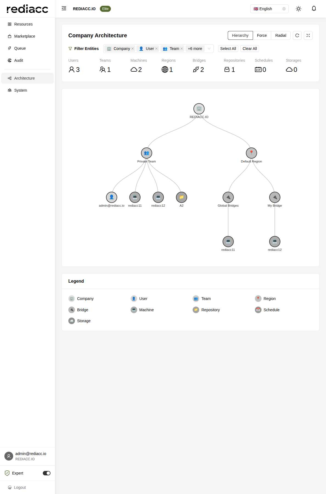

# Architecture Visualization

The Architecture page provides an interactive visual representation of your entire Rediacc infrastructure, showing relationships between all system entities in a dynamic, explorable graph.

## Overview

This powerful visualization tool helps you:
- Understand infrastructure relationships
- Identify dependencies
- Spot potential issues
- Plan system changes
- Document architecture

## Visualization Modes

### 1. Hierarchy View (Default)
Displays entities in a tree structure:
- Company at the root
- Teams and regions as branches
- Resources as leaves
- Clear parent-child relationships

### 2. Force Layout
Dynamic physics-based layout:
- Entities repel each other
- Connected items attract
- Self-organizing structure
- Good for complex relationships

### 3. Radial Layout
Circular arrangement:
- Central entity focus
- Layers represent distance
- Efficient space usage
- Clear relationship depth

## Entity Types

### Company (🏢)
- Root organization entity
- Contains all other entities
- Shows company name
- Central to all relationships

### Users (👤)
- Individual user accounts
- Team memberships
- Permission assignments
- Activity tracking

### Teams (👥)
- Organizational units
- Member count display
- Resource ownership
- Access boundaries

### Regions (📍)
- Geographic locations
- Infrastructure zones
- Latency optimization
- Compliance boundaries

### Bridges (🔌)
- Queue processors
- Machine connections
- Workload distribution
- Processing capacity

### Machines (💻)
- Compute resources
- Task execution
- Bridge assignments
- Repository access

### Repositories (📁)
- Code storage
- Version control
- Deployment sources
- Access management

### Schedules (📅)
- Automated tasks
- Recurring operations
- Time-based triggers
- Dependency chains

### Storage (☁️)
- External storage
- Backup destinations
- Data archives
- Cloud integrations

## Filtering System

### Entity Filter
Multi-select filter for entity types:
- Toggle individual types
- Select/Clear all buttons
- Real-time graph updates
- Persistent selections

### Filter Controls
- **Select All**: Show all entity types
- **Clear All**: Hide all entities
- **Individual toggles**: Custom selection
- **+N more**: Expand filter list

## Interactive Features

### Node Interactions
- **Hover**: View entity details
- **Click**: Focus on entity
- **Drag**: Reposition nodes
- **Double-click**: Expand/collapse

### Graph Controls
- **Zoom**: Mouse wheel or pinch
- **Pan**: Click and drag background
- **Refresh**: Reload latest data
- **Fullscreen**: Maximize view

## Entity Counts

Real-time counters show:
- Total entities per type
- Visual indicators
- Quick system overview
- Resource utilization

## Understanding Relationships

### Connection Types

**Direct Connections:**
- Solid lines
- Parent-child relationships
- Ownership links
- Primary associations

**Indirect Connections:**
- Derived relationships
- Transitive connections
- System dependencies
- Cross-references

### Relationship Patterns

**Hub and Spoke:**
- Central entity (team/region)
- Connected resources
- Clear ownership
- Efficient structure

**Mesh Network:**
- Multiple connections
- Redundant paths
- High availability
- Complex dependencies

**Hierarchical Tree:**
- Clear levels
- Defined ownership
- Simple navigation
- Scalable structure

## Use Cases

### 1. Infrastructure Planning
- Visualize current state
- Identify gaps
- Plan expansions
- Balance resources

### 2. Troubleshooting
- Trace dependencies
- Find bottlenecks
- Identify orphans
- Verify connections

### 3. Security Auditing
- Review access paths
- Check isolation
- Verify boundaries
- Audit permissions

### 4. Documentation
- Export visualizations
- Architecture diagrams
- System documentation
- Stakeholder communication

## Performance Tips

### Large Infrastructures
1. Use entity filters
2. Focus on specific areas
3. Collapse unused branches
4. Use search functionality

### Optimization
- Limit visible entities
- Use appropriate layout
- Disable animations if needed
- Regular data refresh

## Advanced Features

### Search Functionality
- Find specific entities
- Highlight search results
- Navigate to entity
- Filter by properties

### Export Options
- SVG for documentation
- PNG for presentations
- JSON for data analysis
- PDF for reports

### Custom Layouts
- Save layout preferences
- Create custom views
- Share configurations
- Template layouts

## Interpreting the Visualization

### Healthy Architecture
- Balanced distribution
- Clear hierarchies
- No orphaned entities
- Logical groupings

### Problem Indicators
- Isolated entities
- Overcrowded nodes
- Missing connections
- Circular dependencies

### Optimization Opportunities
- Underutilized resources
- Imbalanced distribution
- Redundant entities
- Inefficient paths

## Best Practices

### Regular Review
1. Weekly architecture review
2. Check for orphaned resources
3. Verify relationships
4. Plan optimizations

### Documentation
1. Screenshot key views
2. Document changes
3. Note dependencies
4. Share with team

### Planning
1. Model changes first
2. Identify impacts
3. Plan migrations
4. Test scenarios

## Troubleshooting

### Visualization Issues

**Graph not loading:**
- Check permissions
- Verify data access
- Clear browser cache
- Refresh page

**Missing entities:**
- Check filters
- Verify permissions
- Confirm entity exists
- Refresh data

**Performance problems:**
- Reduce visible entities
- Try different layout
- Close other applications
- Use modern browser

### Data Issues

**Incorrect relationships:**
- Refresh visualization
- Check source data
- Verify configurations
- Contact support

**Stale information:**
- Use refresh button
- Check last update time
- Verify system sync
- Clear cache