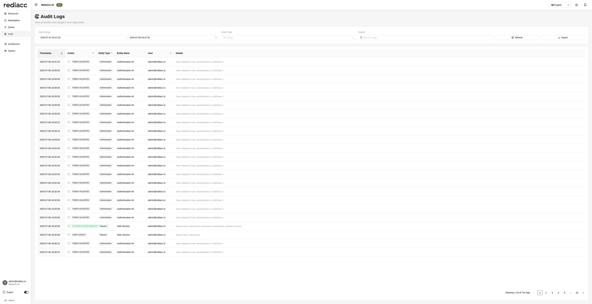

# Audit Logs

The Audit Logs page provides comprehensive tracking of all activities and changes within your Rediacc organization, ensuring compliance, security monitoring, and operational transparency.




## Overview

The audit system captures every significant action performed in your Rediacc installation, providing:
- Complete activity history
- Security incident investigation
- Compliance reporting
- User behavior tracking
- System change documentation

## Interface Components

### Search and Filter Options

#### Date Range
Select the time period for audit log retrieval:
- **Start Date**: Beginning of search period (includes time)
- **End Date**: End of search period (includes time)
- **Default**: Last 7 days
- **Format**: YYYY-MM-DD HH:MM:SS
- **Calendar picker**: Available for easy date selection

#### Entity Type Filter
Filter logs by specific entity types:
- **All entities** (default)
- Authentication
- Request
- Team
- Machine
- Bridge
- Region
- User
- Repository
- Storage
- Schedule
- Company
- Permission

The dropdown provides type-ahead search for quick selection.

#### Search Box
Free-text search across all log fields:
- User names/emails
- Entity names and IDs
- Action descriptions
- Detail messages
- IP addresses
- Request IDs

Search is case-insensitive and searches across all visible columns.

#### Action Buttons
- **🔄 Refresh**: Update log display with latest entries
- **📥 Export**: Download logs (dropdown menu with format options)

### Log Table

The audit log table displays:

#### Columns

1. **Timestamp**
   - Exact date and time of action
   - Sortable (click header to sort ascending/descending)
   - Format: YYYY-MM-DD HH:MM:SS
   - Shows in local timezone

2. **Action**
   - Icon indicating action type (success ✅, info ℹ️, warning ⚠️, error ❌)
   - Action description in UPPERCASE
   - Filterable via filter button 🔽
   - Common actions: TOKEN VALIDATED, AUTHENTICATION REQUEST CREATED, etc.

3. **Entity Type**
   - Type of object affected
   - Filterable via filter button 🔽
   - Color-coded badges for different types

4. **Entity Name**
   - Specific entity identifier
   - Format varies by type (e.g., "Authentication #4", "Web Session")
   - May include entity ID or descriptive name

5. **User**
   - Who performed the action
   - Email address for users
   - System identifier for automated actions
   - Filterable via filter button 🔽

6. **Details**
   - Additional context and parameters
   - Technical details in readable format
   - May include: IP addresses, old/new values, error messages
   - Truncated if too long (hover for full text)

## Action Types

### Authentication Actions

**TOKEN VALIDATED** (ℹ️)
- Successful token validation
- API or web session activity
- Includes old token detection

**AUTHENTICATION REQUEST CREATED** (✅)
- New session initiated
- Login successful
- Permission level assigned

**USER LOGOUT** (ℹ️)
- Session terminated
- Voluntary or forced logout
- Session cleanup

**LOGIN FAILED** (❌)
- Invalid credentials
- Account locked
- Permission denied

### Resource Actions

**CREATED** (✅)
- New resource added
- Initial configuration
- Owner assignment

**UPDATED** (✏️)
- Configuration changed
- Settings modified
- Vault updated

**DELETED** (🗑️)
- Resource removed
- Permanent deletion
- Cascade effects

### Team Actions

**TEAM VAULT UPDATED** (✏️)
- Credentials changed
- Settings modified
- Version incremented

**MEMBER ADDED** (➕)
- User joined team
- Permissions granted
- Access enabled

**MEMBER REMOVED** (➖)
- User removed from team
- Access revoked
- Permissions cleared

### Queue Actions

**QUEUE ITEM CREATED** (✅)
- Task submitted
- Priority assigned
- Target specified

**QUEUE ITEM COMPLETED** (✅)
- Task finished successfully
- Results stored
- Duration recorded

**QUEUE ITEM FAILED** (❌)
- Task encountered error
- Error details logged
- Retry attempted

### System Actions

**CONFIGURATION CHANGED** (⚙️)
- System settings modified
- Global parameters updated
- Feature toggles changed

**MAINTENANCE MODE** (🔧)
- System maintenance started/ended
- User access restricted
- Services paused

**SECURITY ALERT** (🚨)
- Suspicious activity detected
- Security threshold exceeded
- Immediate action required

## Using Audit Logs

### Security Monitoring

1. **Failed Login Attempts**
   - Filter: Action = "LOGIN FAILED"
   - Group by user
   - Identify attack patterns

2. **Privilege Escalation**
   - Filter: Entity Type = "User"
   - Search: "permission" or "role"
   - Track permission changes

3. **Unauthorized Access**
   - Filter: Action contains "DENIED"
   - Review user activities
   - Check access patterns

### Compliance Reporting

1. **User Activity Reports**
   - Filter by user
   - Export date range
   - Document actions

2. **Change Management**
   - Filter: Action = "UPDATED"
   - Track configuration changes
   - Maintain change log

3. **Access Audits**
   - Authentication events
   - Permission changes
   - Session activities

### Troubleshooting

1. **Failed Operations**
   - Filter: Action contains "FAILED"
   - Review error details
   - Identify patterns

2. **System Issues**
   - Search error messages
   - Track related events
   - Find root cause

3. **User Issues**
   - Filter by affected user
   - Review recent actions
   - Identify problems

## Export Options

### Export Formats

**CSV Export**
- Spreadsheet compatible
- All visible columns
- Applied filters preserved
- Date range included

**JSON Export**
- Structured data format
- Complete log entries
- Programmatic processing
- API integration ready

**PDF Export**
- Formatted report
- Executive summary
- Compliance ready
- Print optimized

### Export Contents

Exported logs include:
- Applied filters
- Date range
- Total record count
- Export timestamp
- User who exported

## Best Practices

### Regular Review

1. **Daily Checks**
   - Failed operations
   - Security alerts
   - Unusual patterns

2. **Weekly Analysis**
   - User behavior trends
   - System performance
   - Resource usage

3. **Monthly Reports**
   - Compliance documentation
   - Trend analysis
   - Capacity planning

### Retention Policy

Consider:
- Regulatory requirements
- Storage capacity
- Performance impact
- Archive strategy

### Alert Configuration

Set up alerts for:
- Security events
- Failed operations
- System changes
- Threshold breaches

## Pagination

The audit log interface includes:
- **Default page size**: 23 logs per page
- **Page navigation controls**: Bottom of the table
- **Current page indicator**: Highlighted page number
- **Total record count**: "Showing X-Y of Z logs"

Navigation options:
- **Previous/Next buttons**: Navigate one page at a time
- **Page number links**: Direct jump to specific pages (1-5 shown)
- **Quick jump**: "..." button jumps 5 pages forward
- **Last page shortcut**: Shows last page number for quick access
- **Keyboard navigation**: Use arrow keys when focused on pagination

## Performance Tips

### Large Datasets

1. **Use Specific Filters**
   - Narrow date ranges
   - Select entity types
   - Filter by user

2. **Optimize Searches**
   - Use exact matches
   - Avoid wildcards
   - Combine filters

3. **Export Strategies**
   - Export in batches
   - Schedule off-hours
   - Use date ranges

### Real-Time Monitoring

For live monitoring:
1. Set short date ranges
2. Use specific filters
3. Refresh regularly
4. Monitor key actions

## Integration

### API Access

Audit logs are accessible via API:
```
GET /api/StoredProcedure/GetAuditLogs
```

Parameters:
- startDate
- endDate
- entityType
- searchTerm
- pageNumber
- pageSize

### Webhook Notifications

Configure webhooks for:
- Security events
- Critical changes
- Threshold alerts
- Custom triggers

### SIEM Integration

Export logs to SIEM systems:
- Real-time streaming
- Batch exports
- Custom formatting
- Alert correlation

## Common Use Cases

### Investigating Security Incidents

1. Identify timeframe
2. Filter by affected entities
3. Review user actions
4. Export evidence
5. Document findings

### Compliance Audits

1. Set audit period
2. Export all logs
3. Filter by requirements
4. Generate reports
5. Archive records

### Performance Analysis

1. Filter queue actions
2. Analyze completion times
3. Identify bottlenecks
4. Track improvements
5. Report metrics

### Change Tracking

1. Filter update actions
2. Group by entity
3. Review changes
4. Verify approvals
5. Document impact