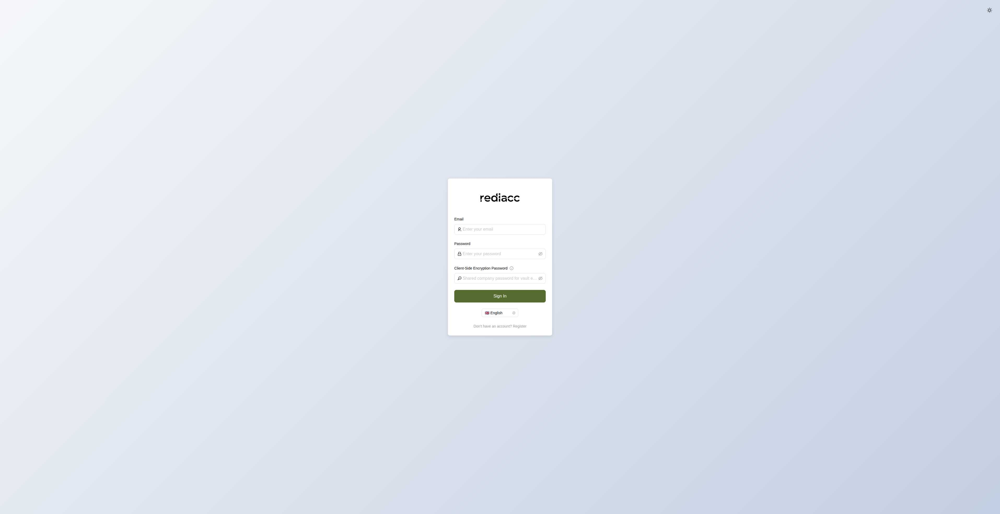

# Authentication & Security

The Rediacc Console implements a robust authentication system with multiple security layers to protect your infrastructure and data.

## Login Process

### Standard Login

The Rediacc Console login page provides a clean, secure interface for authentication:

The standard login process requires three components:

1. **Email Address**: Your registered email address (e.g., admin@rediacc.io)
2. **Password**: Your account password  
3. **Client-Side Encryption Password**: For vault encryption (optional based on company settings)

### Login Steps

1. Navigate to the console URL (e.g., `http://localhost:7322/console/`)
2. Enter your email address in the first field
3. Enter your password in the second field
4. If vault encryption is enabled:
   - Enter your client-side encryption password in the third field
   - This password encrypts sensitive data locally before transmission
5. Click the "Sign In" button to authenticate

### Security Features

#### Token Rotation
- Each API request uses a rotating token system
- Tokens are automatically refreshed with each request
- Prevents token replay attacks

#### Session Management
- Sessions expire after 24 hours of inactivity
- Active sessions are extended automatically
- Multiple concurrent sessions are supported

#### Audit Logging
- All authentication attempts are logged
- Failed login attempts are tracked
- Session activities are recorded for compliance

## Vault Encryption

### Client-Side Encryption

When your organization enables vault encryption:
- Sensitive data is encrypted before leaving your browser
- Encryption password never leaves your device
- Master password is used to derive encryption keys

### Encryption Scope

The following data is encrypted:
- SSH private keys
- API credentials
- Database connection strings
- Custom vault data

### Interface Features

- **Password Visibility Toggle**: Click the eye icon to show/hide password text
- **Language Selection**: Choose your preferred language from the dropdown (🇬🇧 English by default)
- **Theme Toggle**: Switch between light and dark modes using the sun/moon icon
- **Registration Link**: New users can click "Register" to create an account

:::info
The Client-Side Encryption Password field includes an info icon that provides additional context about its purpose. This field is optional and depends on your organization's security settings.
:::

:::warning
If your company has not enabled vault encryption, the client-side encryption password field will be present but not used during authentication. Contact your administrator to enable this additional security layer.
:::

## User Roles & Permissions

### Permission Levels

1. **Administrators**: Full system access
2. **Operators**: Manage resources and queues
3. **Viewers**: Read-only access to dashboards
4. **Custom Roles**: Configured per organization

### Expert Mode

Expert Mode provides additional capabilities:
- Advanced configuration options
- Detailed technical information
- Direct API access tools
- System debugging features

Toggle Expert Mode using the switch in the sidebar.

## Security Best Practices

### Password Requirements
- Minimum 8 characters
- Mix of uppercase and lowercase letters
- Include numbers and special characters
- Avoid common dictionary words

### Session Security
1. Always log out when finished
2. Don't share session tokens
3. Use unique passwords
4. Enable two-factor authentication (if available)

### Browser Recommendations
- Use modern browsers with latest security updates
- Enable browser security features
- Clear cache after using shared computers
- Use private/incognito mode on shared devices

## Account Management

### Profile Settings

Access your profile by clicking on your email in the sidebar:
- View account information
- Change password
- Manage API tokens
- Configure notification preferences

### API Token Management

For programmatic access:
1. Generate API tokens from profile settings
2. Set appropriate expiration dates
3. Use separate tokens for different applications
4. Rotate tokens regularly

### Logout Process

To securely end your session:
1. Click the "Logout" button in the sidebar
2. Confirm logout when prompted
3. Browser will clear session data
4. You'll be redirected to the login page

## Troubleshooting

### Common Login Issues

**"Invalid credentials"**
- Verify email address spelling
- Check password case sensitivity
- Ensure account is active

**"Token expired"**
- Session has timed out
- Log in again to continue

**"Account locked"**
- Too many failed attempts
- Contact administrator to unlock

**"Vault decryption failed"**
- Incorrect encryption password
- Verify with your administrator

### Getting Help

If you cannot access your account:
1. Check with your system administrator
2. Verify your account status
3. Request password reset if needed
4. Review recent audit logs for issues