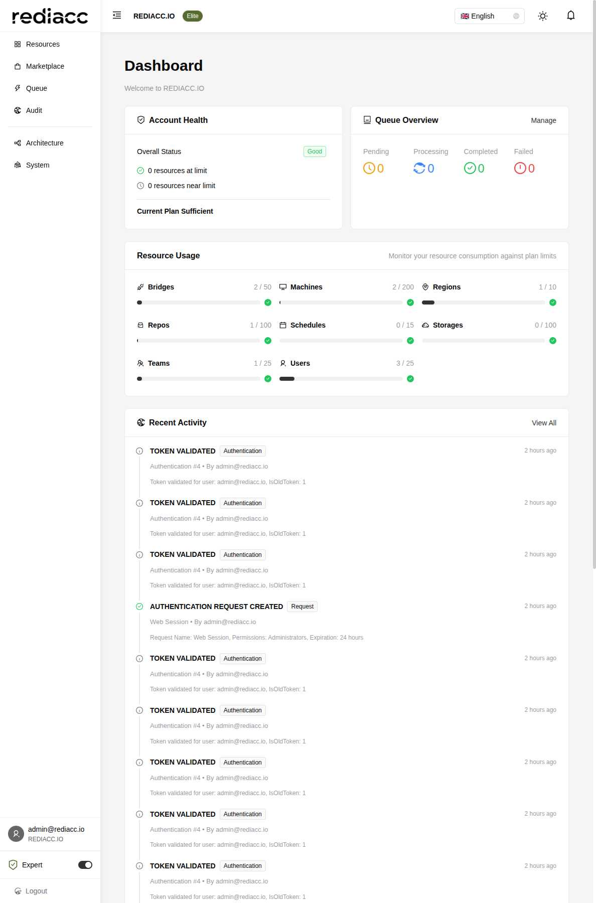

# Dashboard Guide

The Rediacc Dashboard provides a comprehensive overview of your system's health, resource usage, and recent activities. This guide explains each component and how to effectively use the dashboard for monitoring and management.

## Dashboard Components

### 1. Account Health

The Account Health widget provides an at-a-glance view of your system status:

- **Overall Status**: Shows "Good", "Warning", or "Critical"
- **Resource Limits**: 
  - Resources at limit (requiring immediate attention)
  - Resources near limit (approaching thresholds)
- **Plan Status**: Indicates if your current plan is sufficient

**Status Indicators:**
- ✅ Green: Healthy, within limits
- 🕐 Yellow: Approaching limits, monitor closely
- ❌ Red: At or exceeding limits, action required

### 2. Queue Overview

Real-time statistics of your task queue system:

- **Pending**: Tasks waiting to be processed
- **Processing**: Currently executing tasks
- **Completed**: Successfully finished tasks
- **Failed**: Tasks that encountered errors

Click "Manage" to navigate to the detailed queue management interface.

### 3. Resource Usage

Visual progress bars showing consumption against plan limits:

#### Infrastructure Resources
- **Bridges**: Queue processors (2/50)
- **Machines**: Remote servers (2/200)
- **Regions**: Geographic locations (1/10)
- **Repos**: Code repositories (1/100)

#### Configuration Resources
- **Schedules**: Automated tasks (0/15)
- **Storages**: Storage configurations (0/100)
- **Teams**: Organizational units (1/25)
- **Users**: System users (3/25)

Each progress bar shows:
- Current usage / Maximum allowed
- Visual indicator of consumption percentage
- Color coding based on usage levels

### 4. Recent Activity

Live feed of system audit events showing:
- **Event Type**: Icon and description
- **Category**: Authentication, Team, Request, etc.
- **Timestamp**: Relative time (e.g., "2 hours ago")
- **Details**: Specific information about the event
- **User**: Who performed the action

Common event types:
- 🔐 **TOKEN VALIDATED**: Successful authentication
- ✅ **AUTHENTICATION REQUEST CREATED**: New session started
- 📝 **TEAM VAULT UPDATED**: Configuration changes
- 🚪 **USER LOGOUT**: Session ended

### 5. Queue Details

#### Today's Activity
Summary of queue operations for the current day:
- Created: New tasks added
- Completed: Successfully processed
- Cancelled: Manually stopped
- Failed: Encountered errors

#### Machine Queue Status
Table showing queue distribution by machine:
- Machine name
- Associated team
- Pending and active task counts

#### Priority Breakdown
Visual representation of tasks by priority:
- Highest Priority (P1)
- High Priority (P2)
- Normal Priority (P3)
- Low Priority (P4)

### 6. Subscription & Plans

Comprehensive view of your licensing:

#### Current Subscription
- **Plan Name**: Elite, Professional, etc.
- **Description**: Plan capabilities
- **Active Licenses**: Number in use
- **Days Remaining**: Until renewal
- **Monthly Cost**: Subscription price

#### License Details
- Progress bar showing license utilization
- Breakdown by license type
- Expiration information

#### Available Plans
- Options for upgrading or changing plans
- Feature comparisons
- Pricing information

## Using the Dashboard Effectively

### Daily Monitoring Routine

1. **Check Account Health** first for any critical issues
2. **Review Queue Overview** for processing bottlenecks
3. **Scan Resource Usage** for approaching limits
4. **Examine Recent Activity** for unusual patterns

### Performance Indicators

**Healthy System:**
- All resources under 80% utilization
- Queue processing smoothly (few pending)
- No failed tasks in recent activity
- Regular authentication patterns

**System Under Stress:**
- Resources approaching limits (>80%)
- Queue backing up (high pending count)
- Increased failed task rate
- Unusual authentication patterns

### Quick Actions

From the dashboard, you can:
- Click resource names to manage them
- Use "View All" links for detailed views
- Click on activity items for full audit details
- Access queue management directly

## Dashboard Customization

### Display Options

While the current dashboard has a fixed layout, you can:
- Toggle Expert Mode for additional details
- Switch between light/dark themes
- Adjust language preferences
- Control notification settings

### Data Refresh

The dashboard updates automatically:
- Queue statistics: Real-time
- Resource usage: Every 30 seconds
- Recent activity: As events occur
- Subscription data: On page load

## Troubleshooting Dashboard Issues

### Common Problems

**Dashboard not loading:**
- Check network connectivity
- Verify authentication status
- Clear browser cache
- Try refreshing the page

**Incorrect data displayed:**
- Ensure proper permissions
- Check for system notifications
- Verify data refresh timing
- Contact support if persistent

**Performance issues:**
- Reduce browser tabs
- Check network speed
- Clear browser cache
- Disable browser extensions

### Getting Help

For dashboard-specific issues:
1. Check the notification bell for alerts
2. Review audit logs for errors
3. Consult system documentation
4. Contact your administrator