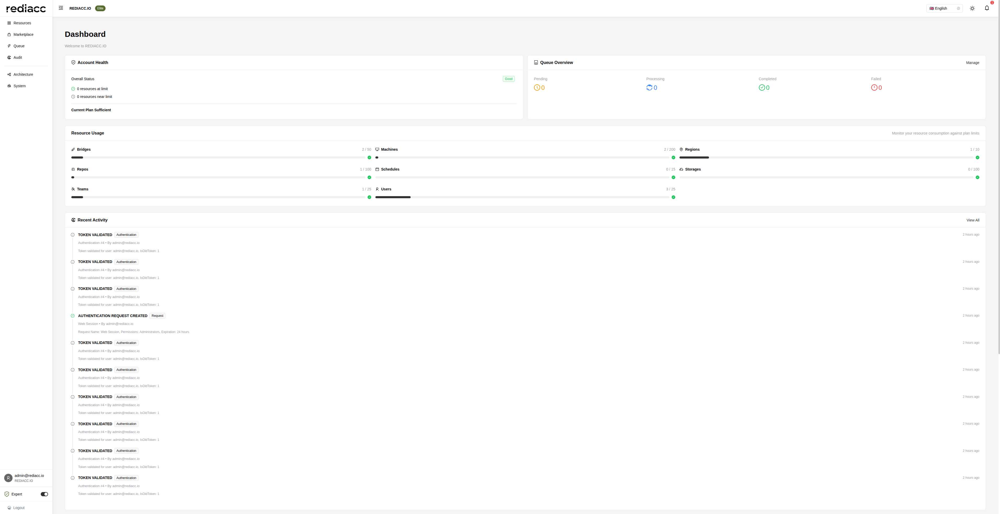

# Dashboard Guide

The Rediacc Dashboard is your central command center, providing real-time insights into system health, resource utilization, queue operations, and organizational activity. This comprehensive guide explains each dashboard component and how to leverage them for effective infrastructure management.



## Dashboard Layout

The dashboard is organized into distinct sections for optimal information visibility:

1. **Header**: Navigation bar with notification bell and user controls
2. **Top Row**: Account Health and Queue Overview
3. **Middle Section**: Resource Usage Grid
4. **Bottom Row**: Recent Activity, Queue Details, and Subscription Information

## Dashboard Components

### Header Navigation

The dashboard header provides quick access to key features:

- **Notification Bell** (🔔): 
  - Shows red badge with unread notification count
  - Click to open dropdown with recent notifications
  - Supports success, error, warning, and info notifications
  - See [Notifications Guide](./notifications.md) for details

- **Language Selector**: Switch between 9 supported languages
- **Theme Toggle**: Switch between light/dark/auto themes  
- **User Menu**: Access profile settings and logout

### 1. Account Health Widget

Located in the top-left corner, this critical status indicator provides instant system health assessment:

#### Overall Status
- **Good** (Green): All systems operating normally
- **Warning** (Yellow): Some resources approaching limits
- **Critical** (Red): Immediate attention required

#### Resource Monitoring
The widget displays two key metrics:
- **Resources at Limit**: Count of resources that have reached maximum capacity
- **Resources Near Limit**: Count of resources above 80% utilization

#### Plan Assessment
- **"Current Plan Sufficient"**: Your subscription meets current needs
- **"Plan Upgrade Recommended"**: Consider upgrading for additional capacity

**Visual Indicators:**
- ✅ Check Circle: Healthy state
- 🕐 Clock Circle: Warning state
- ❌ Exclamation Circle: Critical state

### 2. Queue Overview Widget

Positioned in the top-right corner with a direct "Manage" link to queue operations:

#### Queue States
The widget displays four primary queue metrics with icon indicators:

- **Pending** (🕐 Clock Icon): Tasks awaiting bridge assignment
- **Processing** (🔄 Sync Icon): Tasks currently being executed
- **Completed** (✅ Check Icon): Successfully finished tasks
- **Failed** (❌ Exclamation Icon): Tasks that encountered errors

#### Quick Actions
- **Manage Button**: Direct navigation to the Queue Management page
- **Real-time Updates**: Counts refresh automatically as queue state changes

### 3. Resource Usage Grid

The central dashboard section displays a comprehensive grid of resource utilization with visual progress indicators:

#### Infrastructure Resources (Left Column)
- **🔌 Bridges**: Queue processing nodes (API icon)
  - Global and regional bridge allocations
  - Current: 2 / Maximum: 50
  
- **💻 Machines**: Remote server instances (Desktop icon)
  - SSH-accessible compute resources
  - Current: 2 / Maximum: 200
  
- **🌍 Regions**: Geographic or logical zones (Environment icon)
  - Organizational boundaries for resources
  - Current: 1 / Maximum: 10
  
- **📦 Repos**: Repository configurations (Inbox icon)
  - Git, Docker, and custom repository types
  - Current: 1 / Maximum: 100

#### Configuration Resources (Right Column)
- **📅 Schedules**: Automated task definitions (Calendar icon)
  - Cron-based and recurring operations
  - Current: 0 / Maximum: 15
  
- **☁️ Storages**: Backup and storage endpoints (Cloud icon)
  - S3, Azure, GCS, SFTP configurations
  - Current: 0 / Maximum: 100
  
- **👥 Teams**: Organizational units (Team icon)
  - Logical groupings with shared resources
  - Current: 1 / Maximum: 25
  
- **👤 Users**: System accounts (User icon)
  - Individual user accounts and service accounts
  - Current: 3 / Maximum: 25

#### Progress Bar Indicators
Each resource displays:
- **Numerical Count**: "Current / Maximum"
- **Visual Bar**: Proportional fill based on usage
- **Color Coding**:
  - Green (0-60%): Healthy utilization
  - Yellow (60-80%): Monitor closely
  - Orange (80-90%): Approaching limit
  - Red (90-100%): Critical, action required

### 4. Recent Activity Feed

Located in the bottom-left section, this live audit stream provides transparency into system operations:

#### Feed Components
Each activity entry displays:
- **Status Icon**: Visual indicator of event type
- **Event Name**: Action performed (e.g., "TOKEN VALIDATED")
- **Category Tag**: Event classification (Authentication, Team, Request)
- **Timestamp**: Relative time display ("2 hours ago")
- **Details Line**: Specific context (e.g., "Authentication #4 • By admin@rediacc.io")
- **Description**: Detailed event information

#### Common Event Types

**Authentication Events:**
- ℹ️ **TOKEN VALIDATED**: API token verification
  - Shows user email and token status
  - Indicates if using old vs new token (IsOldToken: 1)
  
- ✅ **AUTHENTICATION REQUEST CREATED**: New session initiated
  - Displays request name (e.g., "Web Session")
  - Shows permissions group (e.g., "Administrators")
  - Indicates expiration timeframe (e.g., "24 hours")

**Configuration Events:**
- 📝 **VAULT UPDATED**: Configuration changes
  - Team, Machine, or Company vault modifications
  - Shows what was changed

**User Events:**
- 👤 **USER CREATED/DEACTIVATED**: Account lifecycle
- 🚪 **USER LOGOUT**: Session termination
- 🔑 **PASSWORD CHANGED**: Security updates

#### Navigation
- **"View All" Link**: Navigate to complete Audit page
- **Scrollable List**: Shows latest 10 events
- **Real-time Updates**: New events appear automatically

### 5. Queue Details Panel

The center-bottom section provides deep insights into queue operations:

#### Today's Activity Summary
Real-time counters for the current day's queue operations:
- **Created**: New tasks submitted today
- **Completed**: Successfully processed tasks
- **Cancelled**: Manually terminated tasks
- **Failed**: Tasks encountering errors

#### Machine Queue Status Table
Displays current queue status for each machine:

| Column | Description |
|--------|-------------|
| **Machine** | Server name identifier with icon |
| **Team** | Owning team assignment |
| **Status** | Shows pending and active task counts |

Status format: "X pending Y active" where:
- X = number of tasks waiting for processing
- Y = number of tasks currently being executed

Example row: "rediacc12 | Private Team | 1 pending 0 active"

#### Priority Breakdown
Visual representation of queue items organized by priority level with colored bars:
- **Highest Priority**: Priority 1 tasks (most urgent) - Red bar
- **High Priority**: Priority 2 tasks - Orange bar
- **Normal Priority**: Priority 3 tasks (default) - Blue bar
- **Low Priority**: Priority 4-5 tasks - Gray bar

The number of items at each priority level is shown as a superscript badge next to the priority label.

### 6. Subscription & Plans Widget

Located in the bottom-right corner with a notification badge for important updates:

#### Current Subscription Display
Shows your active subscription details:
- **Plan Tier**: Elite, Professional, Essential
- **Description**: Brief plan capabilities summary
- **Billing Details**:
  - Monthly cost in USD
  - Billing cycle (monthly/annual)
  - Active licenses count
  - Days remaining in current period

Example Display:
```
CURRENT SUBSCRIPTION
Elite
Enterprise tier with unlimited access
Active Licenses: 1
Days Remaining: 3,652

Monthly Cost
$6999.00
Billed monthly • USD
```

#### All Active Licenses
Visual representation of license utilization:
- **Total Count**: "1 Total" header
- **License Breakdown**: 
  - Plan name with quantity (e.g., "Elite ×1")
  - Days remaining for each license
  - Progress bar showing time utilization

#### Available Plans Section
Quick comparison of upgrade/downgrade options:
- **Plan Name** with current indicator
- **User Limits**: "Up to X users"
- **Feature Summary**: Key capabilities
- **Pricing**: Monthly cost display

## Dashboard Notifications

The dashboard includes several notification mechanisms:

### Visual Alerts
- **Header Notification Bell**: Shows system notifications
  - Click to open notification dropdown
  - Real-time updates for important system events
- **Widget Badges**: Numerical indicators on sections requiring attention

### Status Indicators
- **Superscript Numbers**: Count badges on widgets (e.g., "¹" on Subscription & Plans showing active items)
- **Color-Coded Elements**: Visual priority through color usage
- **Icon States**: Different icons for various states (check, warning, error)
- **Progress Bars**: Visual representation of resource utilization with color coding:
  - Green: Healthy utilization
  - Yellow: Approaching limits
  - Red: Critical capacity

## Using the Dashboard Effectively

### Recommended Monitoring Workflow

1. **Initial Health Check** (5 seconds)
   - Glance at Account Health widget
   - Note any red/yellow indicators
   - Check notification bell count

2. **Queue Assessment** (10 seconds)
   - Review pending vs processing ratio
   - Check failed task count
   - Note priority distribution

3. **Resource Scan** (15 seconds)
   - Identify resources above 80%
   - Plan capacity increases if needed
   - Note any at-limit resources

4. **Activity Review** (20 seconds)
   - Scan for authentication anomalies
   - Check for repeated failures
   - Note configuration changes

### Performance Indicators

#### Healthy System Characteristics
- ✅ Account Health shows "Good" status
- ✅ Resource utilization below 80%
- ✅ Minimal queue backlog (low pending count)
- ✅ Failed tasks under 5% of total
- ✅ Regular, expected authentication patterns
- ✅ No critical notifications

#### Warning Signs
- ⚠️ Multiple resources approaching limits
- ⚠️ Queue pending count growing
- ⚠️ Increased authentication failures
- ⚠️ Unusual activity patterns
- ⚠️ Plan insufficiency warnings

#### Critical Issues
- 🚨 Resources at maximum capacity
- 🚨 Queue processing stopped
- 🚨 High failure rates (>10%)
- 🚨 Security-related alerts
- 🚨 System-wide errors

### Quick Navigation

The dashboard serves as a launching point for detailed management:

| From Dashboard Element | Navigate To | Action |
|------------------------|-------------|---------|
| Queue Overview "Manage" | Queue Management | Detailed queue operations |
| Resource names | Resources page | Manage specific resource type |
| Recent Activity "View All" | Audit page | Complete audit history |
| Machine in Queue Status | Machine details | Individual machine management |
| Subscription widget | Billing page | Plan management |

## Dashboard Features

### Expert Mode
When enabled via the sidebar toggle:
- Displays additional technical details
- Shows internal IDs and references  
- Provides advanced filtering options
- Reveals system-level metrics

### Theme Support
- **Light Mode**: Default bright interface
- **Dark Mode**: Reduced eye strain option
- **Automatic**: Follows system preferences
- Toggle via sun/moon icon in header

### Language Support
- Multiple language options available
- Select from dropdown in header
- Affects dates, numbers, and UI text
- Persists across sessions

### Data Refresh Rates

| Component | Refresh Interval | Method |
|-----------|------------------|---------|
| Queue Statistics | Real-time | WebSocket |
| Resource Usage | 30 seconds | Polling |
| Recent Activity | Real-time | Event stream |
| Machine Status | 1 minute | API polling |
| Subscription | Page load | On demand |

## Troubleshooting Dashboard Issues

### Common Problems and Solutions

#### Dashboard Not Loading
1. **Authentication Issues**
   - Verify login credentials
   - Check session expiration
   - Clear cookies and re-login

2. **Network Problems**
   - Test API connectivity
   - Check firewall settings
   - Verify proxy configuration

3. **Browser Issues**
   - Clear browser cache (Ctrl+Shift+Delete)
   - Try incognito/private mode
   - Update to latest browser version
   - Disable conflicting extensions

#### Data Display Problems

**Stale or Missing Data:**
- Check last refresh timestamp
- Manually refresh page (F5)
- Verify API endpoints responding
- Check browser console for errors

**Incorrect Counts:**
- Ensure proper team selection
- Verify user permissions
- Check filter settings
- Compare with audit logs

**Widget Loading Errors:**
- Check specific API calls in Network tab
- Verify vault decryption working
- Ensure master password correct
- Review error messages

#### Performance Optimization

**Slow Dashboard Loading:**
1. Close unnecessary browser tabs
2. Disable resource-heavy extensions
3. Check network latency to API
4. Consider using Edge/Chrome for best performance

**High Memory Usage:**
- Limit dashboard refresh frequency
- Reduce activity feed history
- Close other Rediacc Console tabs
- Restart browser periodically

### Getting Support

When issues persist:

1. **Collect Information**
   - Screenshot of the issue
   - Browser console errors (F12)
   - Network tab HAR file
   - Time of occurrence

2. **Check Resources**
   - System status page
   - Known issues list
   - Admin notifications
   - Audit log entries

3. **Escalation Path**
   - Contact system administrator
   - Submit support ticket
   - Include collected information

### Vault Encryption Warning

If you see a warning banner stating "Your company has not enabled vault encryption yet. The master password you entered will not be used.":

**What it means:**
- Your organization hasn't activated client-side encryption
- Sensitive data is encrypted server-side only
- The master password field during login is ignored

**Resolution:**
1. Contact your system administrator
2. Request vault encryption activation
3. Once enabled, the warning will disappear
4. Your master password will then be required for decrypting vault data

**Security Impact:**
- Data is still encrypted at rest
- Server administrators could potentially access vault contents
- Client-side encryption adds an extra security layer
   - Specify impact level

## Best Practices

### Daily Usage
- Start each day with dashboard review
- Set up browser bookmark for quick access
- Use multiple monitors for persistent display
- Configure browser notifications

### Team Coordination
- Share dashboard screenshots in team channels
- Establish resource usage thresholds
- Create escalation procedures
- Document standard responses

### Capacity Planning
- Monitor resource trends weekly
- Plan upgrades before hitting limits
- Review queue patterns monthly
- Analyze failure rates regularly