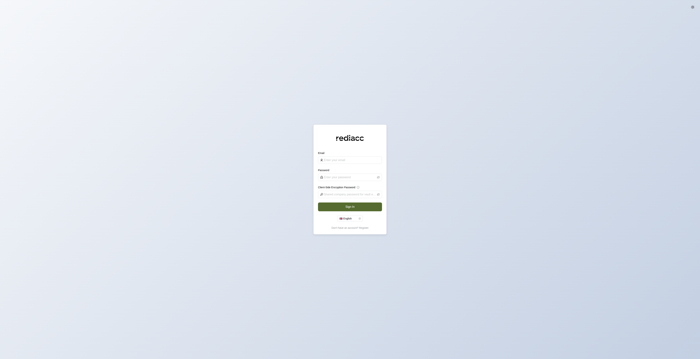

# Console Introduction

Welcome to the Rediacc Console documentation. The Rediacc Console is a powerful web-based interface for managing your distributed task execution system.

## Overview

The Rediacc Console provides a comprehensive dashboard and management interface for:

- **Resource Management**: Monitor and manage bridges, machines, regions, repositories, and teams
- **Queue Operations**: Track and manage distributed task execution across your infrastructure
- **System Administration**: Configure authentication, permissions, and system settings
- **Audit & Compliance**: View detailed audit logs of all system activities
- **Subscription Management**: Monitor usage against plan limits and manage licenses

## Getting Started

### Accessing the Console

The Rediacc Console is accessible via web browser at your configured domain. For local development, this is typically:

```
http://localhost:7322/console/
```



### Login Requirements

To access the console, you'll need:

1. **Email**: Your registered email address
2. **Password**: Your account password
3. **Client-Side Encryption Password**: Used for vault encryption (required for secure data access)


### First-Time Login

When logging in for the first time:

1. Navigate to the console URL
2. Enter your email address
3. Enter your password
4. If your company has enabled vault encryption, enter your client-side encryption password
5. Click "Sign In"

## Navigation

The console uses a collapsible sidebar navigation system with two main sections:

### Primary Navigation
- **Resources**: Infrastructure and resource management (Machines, Repositories, Storage, Schedules)
- **Marketplace**: Deploy pre-configured application templates
- **Queue**: Monitor and manage task queues with advanced filtering
- **Audit**: View detailed system audit logs and activity history

### System Navigation
- **Architecture**: System architecture configuration for regions and bridges
- **System**: System-wide settings including users, teams, permissions, and user sessions

### Additional UI Features
- **Expert Mode Toggle**: Located in the sidebar, enables advanced features and detailed technical information
- **User Profile Section**: Displays your email and company name
- **Header Controls**: Language selector, theme toggle (light/dark), and notifications bell

## Dashboard Overview

Upon login, you'll see the main dashboard which provides:

- **Account Health**: Overall system status indicator showing resource limit warnings
- **Queue Overview**: Real-time statistics for Pending, Processing, Completed, and Failed tasks
- **Resource Usage**: Visual progress bars showing consumption vs. limits for:
  - Bridges, Machines, Regions, Repositories, Schedules, Storage, Teams, and Users
- **Recent Activity**: Latest audit log entries with severity indicators
- **Queue Details**: Machine-specific queue status and priority breakdown
- **Subscription & Plans**: Current subscription tier, active licenses, and billing information

## Key Features

### Expert Mode

The console includes an "Expert Mode" toggle that provides access to advanced features and detailed technical information. This mode is recommended for experienced administrators.

### Multi-Language Support

The interface supports multiple languages, selectable from the language dropdown in the header.

### Dark Mode

Toggle between light and dark themes using the theme switcher in the header for comfortable viewing in different lighting conditions.

### Real-Time Updates

The console provides real-time updates for queue status and system activities, ensuring you always have the latest information.

## Next Steps

- [Authentication & Security](./authentication.md) - Learn about login security and session management
- [Dashboard Guide](./dashboard.md) - Detailed guide to dashboard features
- [Resource Management](./resources/index.md) - Managing infrastructure resources
- [Queue Operations](./queue.md) - Working with the task queue system