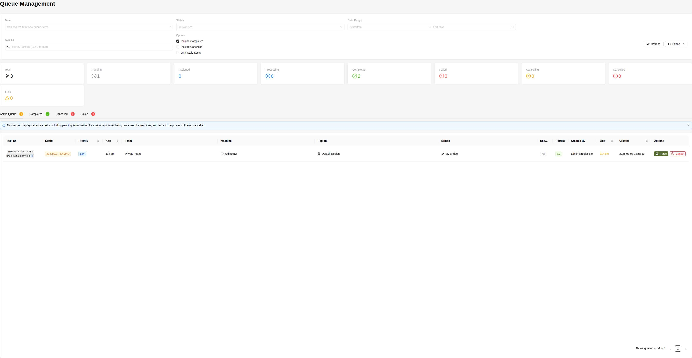

# Queue Management

The Queue Management interface is your mission control for distributed task execution, providing real-time visibility and control over all operations flowing through your Rediacc infrastructure. From here, you can monitor task progress, diagnose issues, and manage the entire lifecycle of queued operations.



## Overview

The queue system orchestrates distributed task execution using a sophisticated state machine:
- **Tasks** are created with specific operations and target machines
- **Bridges** poll for and claim tasks based on availability and assignment rules  
- **Machines** execute the actual operations via SSH
- **Results** flow back through the system with full audit trails

## Queue Interface Layout

The interface is organized into three main sections:

### Top Section: Filters and Controls
Powerful filtering options to find exactly what you need:

#### Team Selection Dropdown
- **Default**: "Select a team to view queue items" placeholder
- **Options**: All teams you have access to
- **Behavior**: Filters display to selected team's tasks only
- **Permissions**: Shows only teams where you have queue visibility

#### Status Filter
- **Default**: "All statuses" - shows everything
- **Options**:
  - PENDING - Awaiting bridge assignment
  - ASSIGNED - Claimed by bridge
  - PROCESSING - Currently executing
  - COMPLETED - Successfully finished
  - FAILED - Error encountered
  - CANCELLING - Termination in progress
  - CANCELLED - Successfully stopped
  - STALE - No recent updates
  - STALE_PENDING - Pending task with no updates (warning state)

#### Date Range Selector
- **Start Date**: Calendar picker with time
- **End Date**: Calendar picker with time
- **Divider**: Arrow icon between dates
- **Format**: YYYY-MM-DD HH:MM:SS
- **Default**: Last 7 days of data

#### Task ID Search
- **Input**: Text field with search icon
- **Placeholder**: "Filter by Task ID (GUID format)"
- **Format**: Full or partial GUID (e.g., "f0103610" or complete UUID like "f0103610-8fef-4488-8cc8-60fc98bdf303")
- **Behavior**: Real-time filtering as you type
- **Case-insensitive**: Matches upper or lowercase
- **Note**: Task IDs are standard GUIDs/UUIDs in the format XXXXXXXX-XXXX-XXXX-XXXX-XXXXXXXXXXXX

### Middle Section: Options and Actions

#### Checkbox Filters
Three toggle options for fine-tuning your view:
- **☑️ Include Completed**: Shows successfully finished tasks (checked by default)
- **☐ Include Cancelled**: Shows manually stopped tasks (unchecked by default)  
- **☐ Only Stale Items**: Filters to only show tasks with no recent updates

#### Action Buttons
- **🔄 Refresh**: Manual data refresh with spinning icon
- **📤 Export ▼**: Dropdown with export options:
  - **CSV**: Excel-compatible format with all columns
  - **JSON**: Complete data structure for APIs
  - **PDF**: Formatted report for documentation

### Bottom Section: Status Summary Bar

A horizontal bar displaying real-time task counts with visual indicators:

| Status | Icon | Description | Color |
|--------|------|-------------|--------|
| **Total** | ⚡ | All tasks matching filters | Dark |
| **Pending** | 🕐 | Awaiting bridge pickup | Orange |
| **Assigned** | - | Bridge claimed, pre-execution | Blue |
| **Processing** | ▶️ | Currently running | Blue |
| **Completed** | ✅ | Successfully finished | Green |
| **Failed** | ❌ | Encountered errors | Red |
| **Cancelling** | ▶️ | Stop signal sent | Yellow |
| **Cancelled** | ⭕ | Successfully stopped | Gray |
| **Stale** | ⚠️ | No updates >15 minutes | Yellow |
| **Stale_Pending** | ⚠️ | Pending with no bridge pickup | Yellow/Orange |

Each counter updates in real-time as tasks change state.

## Queue Tabs

The interface provides tabbed navigation for different task states:

### Active Queue Tab
**Badge**: Shows count of active items (e.g., "Active Queue ¹")

Displays all non-terminal tasks including:
- **PENDING**: Waiting in queue for bridge assignment
- **STALE_PENDING**: Pending items with no bridge activity for extended period (shown with warning icon)
- **ASSIGNED**: Claimed by a bridge but not yet started
- **PROCESSING**: Currently executing on target machine
- **CANCELLING**: Termination signal sent, awaiting confirmation

**Info Banner**: "This section displays all active tasks including pending items waiting for assignment, tasks being processed by machines, and tasks in the process of being cancelled."

### Completed Tab  
**Badge**: Shows count of completed tasks (e.g., "Completed ²")

Successfully finished tasks with:
- Final execution status
- Total processing time
- Output/response availability
- Success confirmation

### Cancelled Tab
**Badge**: Shows cancelled count (e.g., "Cancelled ⁰")

Manually terminated tasks showing:
- Who initiated cancellation
- Cancellation timestamp
- State at cancellation
- Any partial results

### Failed Tab
**Badge**: Shows failure count (e.g., "Failed ⁰")

Tasks that encountered errors with:
- Detailed error messages
- Failure point in execution
- Retry attempt history
- Diagnostic information

## Queue Table Structure

The main queue table displays comprehensive task information:

### Column Details

| Column | Description | Example |
|--------|-------------|---------|
| **Task ID** | Unique GUID with copy button | `f0103610-8fef-4488...` 📋 |
| **Status** | Icon + state label | 🕐 PENDING |
| **Priority** | Task urgency level | Low, Normal, High, Highest |
| **Age** | Time since creation | 5h 14m |
| **Team** | Owning organization | Private Team |
| **Machine** | Target server with icon | 💻 rediacc12 |
| **Region** | Geographic zone with icon | 🌍 Default Region |
| **Bridge** | Processing node with icon | 🔌 My Bridge |
| **Response** | Has output data | Yes/No |
| **Retries** | Attempt counter | 0/2 |
| **Created By** | Task originator | admin@rediacc.io |
| **Created** | Full timestamp | 2025-07-08 12:58:39 |
| **Actions** | Available operations | 📜 Trace ⭕ Cancel |

### Visual Indicators

**Status Icons**:
- 🕐 Clock = Pending
- 🔄 Sync = Processing  
- ✅ Check = Completed
- ❌ Cross = Failed
- ⭕ Circle = Cancelled

**Resource Icons**:
- 💻 Desktop = Machine
- 🌍 Globe = Region
- 🔌 API = Bridge
- 📜 History = Trace logs

### Interactive Elements

1. **Task ID Copy**: Click the 📋 icon to copy full GUID to clipboard
2. **Sortable Columns**: Click column headers with arrow icons to sort
3. **Row Hover**: Highlights on mouse-over for easier reading
4. **Action Buttons**: Appear on row hover for clean interface

## Task Lifecycle

### 1. Creation
Tasks are created through:
- Console UI actions
- CLI commands
- API calls
- Scheduled operations

### 2. Assignment
Bridge selection based on:
- Machine's preferred bridge
- Bridge availability
- Load balancing
- Region proximity

### 3. Processing
During execution:
- Bridge connects to machine
- Executes configured operations
- Streams output back
- Updates status in real-time

### 4. Completion
Terminal states:
- **Completed**: Successful execution
- **Failed**: Error encountered
- **Cancelled**: Manually stopped

## Priority Management

Task priorities determine processing order:

1. **Highest Priority**: Emergency tasks
   - System critical operations
   - Disaster recovery
   - Security responses

2. **High Priority**: Important operations
   - Production deployments
   - Backup operations
   - User-initiated tasks

3. **Normal Priority**: Standard operations
   - Routine maintenance
   - Scheduled tasks
   - Batch processing

4. **Low Priority**: Background tasks
   - Cleanup operations
   - Analytics gathering
   - Non-urgent updates

## Queue Actions

### Trace Functionality
View detailed task information:
- Complete execution logs
- Timing information
- Error details
- Vault data (if permitted)

### Cancel Operations
Cancel active tasks:
- Sends termination signal
- Graceful shutdown attempted
- Force kill if necessary
- Logs cancellation reason

### Bulk Operations
With appropriate permissions:
- Select multiple tasks
- Bulk cancel
- Bulk retry failed tasks
- Bulk export

## Table Navigation

### Pagination Controls
Located below the queue table:
- **Record Counter**: "Showing records X-Y of Z"
- **Previous Page**: ◀️ button (disabled on first page)
- **Page Numbers**: Clickable page indicators
- **Next Page**: ▶️ button (disabled on last page)
- **Page Size**: Dropdown to select rows per page (10, 25, 50, 100)

### Sorting Options
Click column headers to sort by:
- Priority (Highest → Lowest)
- Age (Newest → Oldest) 
- Retries (Most → Least)
- Created timestamp

## Monitoring Best Practices

### Daily Health Checks

1. **Morning Review** (5 minutes)
   - Check overnight failures in Failed tab
   - Review any stale items
   - Verify bridges are processing
   - Note queue depth trends

2. **Midday Check** (2 minutes)
   - Monitor pending count growth
   - Ensure no bridge bottlenecks
   - Quick scan of failure reasons

3. **End of Day** (5 minutes)
   - Review completion rates
   - Check retry patterns
   - Plan overnight capacity
   - Export daily summary

### Key Performance Indicators

#### Healthy Queue Metrics
- ✅ **Completion Rate**: >95% success
- ✅ **Queue Depth**: <100 pending items
- ✅ **Processing Time**: Consistent with SLAs
- ✅ **Retry Rate**: <5% of tasks
- ✅ **Stale Items**: Zero
- ✅ **Bridge Utilization**: 40-80%

#### Warning Signs
- ⚠️ **Rising Pending**: Consistent growth
- ⚠️ **Failure Spike**: >10% failure rate
- ⚠️ **Stale Accumulation**: >5 items
- ⚠️ **Retry Storms**: Same tasks failing repeatedly
- ⚠️ **Bridge Saturation**: All at capacity

### Common Patterns

**Bridge Offline:**
- Tasks remain pending
- No assignment occurring
- Check bridge status

**Machine Issues:**
- Tasks failing consistently
- Same machine affected
- Check connectivity

**Configuration Problems:**
- Immediate failures
- No processing time
- Review vault data

## Troubleshooting Guide

### Common Issues and Solutions

#### Tasks Stuck in PENDING State

**Symptoms**: Tasks remain pending for extended periods

**Diagnostic Steps**:
1. **Check Bridge Status**
   ```bash
   # Verify bridges are running
   ./bridge --bridge-mode status
   ```
2. **Validate Assignment**
   - Navigate to System → Regions & Infrastructure
   - Verify machine has assigned bridge
   - Check bridge has "Access" status

3. **Review Capacity**
   - Check bridge batch_size setting
   - Monitor current processing load
   - Consider adding bridges if saturated

**Solutions**:
- Restart stuck bridge
- Reassign machine to different bridge
- Increase bridge batch_size
- Deploy additional bridges

#### High Failure Rates

**Common Causes & Fixes**:

| Error Pattern | Likely Cause | Solution |
|---------------|--------------|----------|
| Immediate failures | Bad configuration | Check vault data |
| SSH connection errors | Network/credentials | Verify SSH keys |
| Timeout errors | Long-running tasks | Increase timeout |
| Permission denied | User privileges | Check machine user |
| Command not found | Missing dependencies | Install on machine |

**Investigation Process**:
1. Click **Trace** on failed task
2. Review complete error output
3. Check vault configuration
4. Test manually via CLI:
   ```bash
   ./rediacc term --machine <name> --command "<cmd>"
   ```

#### Stale Task Management

**Definition**: Tasks with no status update for 15+ minutes

**Common Scenarios**:
- Bridge crashed during execution
- Machine became unresponsive
- Network partition occurred
- Task genuinely long-running

**Recovery Steps**:
1. **Identify scope**: Filter by "Only Stale Items"
2. **Check bridge health**: Review bridge logs
3. **Test connectivity**: Ping target machines
4. **Make decision**:
   - Cancel if genuinely stuck
   - Wait if legitimately long-running
   - Retry if transient issue

#### Performance Optimization

**Queue Bottlenecks**:

1. **Bridge Capacity**
   - Current: 3 tasks per poll (default)
   - Increase: `batch_size=10` for high volume
   - Monitor: CPU/memory on bridge host

2. **Priority Tuning**
   ```
   Highest → Critical operations only
   High    → User-initiated tasks
   Normal  → Standard operations (default)
   Low     → Background/maintenance
   ```

3. **Regional Distribution**
   - Deploy bridges closer to machines
   - Use region-specific bridges
   - Balance load across regions

## Export Options

### CSV Export
Includes:
- All visible columns
- Applied filters
- Formatted timestamps
- Ready for Excel

### JSON Export
Provides:
- Complete task data
- Nested structures
- Vault information (redacted)
- API-compatible format

### PDF Export
Contains:
- Summary statistics
- Task listing
- Applied filters
- Timestamp of export

## Advanced Features

### Real-time Monitoring

#### WebSocket Updates
The queue interface uses WebSocket connections for live updates:
- Automatic status changes without refresh
- New task notifications
- Completion alerts
- Real-time counter updates

#### Performance Metrics
Track key operational metrics:
- **Average Processing Time**: By machine, bridge, and task type
- **Success Rates**: Daily, weekly, monthly trends  
- **Queue Velocity**: Tasks processed per hour
- **Retry Patterns**: Identify problematic operations

### Automation Capabilities

#### Alert Configuration
Set up notifications for:
- Queue depth thresholds (e.g., >100 pending)
- Failure rate spikes (e.g., >10% in 5 minutes)
- Stale task accumulation
- Bridge offline events
- Specific error patterns

#### API Integration
Programmatic queue management:
```bash
# List queue items
curl -X POST https://api.rediacc.com/api/StoredProcedure/GetQueueItems \
  -H "Rediacc-RequestToken: $TOKEN" \
  -d '{"teamName": "Production", "status": "PENDING"}'

# Cancel task
curl -X POST https://api.rediacc.com/api/StoredProcedure/CancelQueueItem \
  -H "Rediacc-RequestToken: $TOKEN" \
  -d '{"taskId": "f0103610-8fef-4488-8cc8-60fc98bdf303"}'
```

#### Webhook Events
Subscribe to queue events:
- Task state changes
- Failure notifications
- Completion callbacks
- Stale warnings

### Queue Optimization Strategies

#### Load Distribution
1. **Time-based**: Schedule low-priority tasks off-peak
2. **Priority lanes**: Dedicate bridges to high-priority
3. **Regional affinity**: Keep tasks near data
4. **Resource pools**: Separate dev/prod queues

#### Failure Reduction
1. **Retry policies**: Exponential backoff
2. **Circuit breakers**: Stop cascading failures
3. **Health checks**: Pre-flight validation
4. **Timeout tuning**: Task-appropriate limits

## Security Considerations

### Access Control
- Team-based queue visibility
- Role-based action permissions
- Audit trail for all operations
- Encrypted vault data

### Best Practices
1. Never expose task IDs publicly
2. Rotate bridge tokens regularly
3. Monitor for unusual patterns
4. Implement queue ACLs
5. Use encrypted vaults for secrets