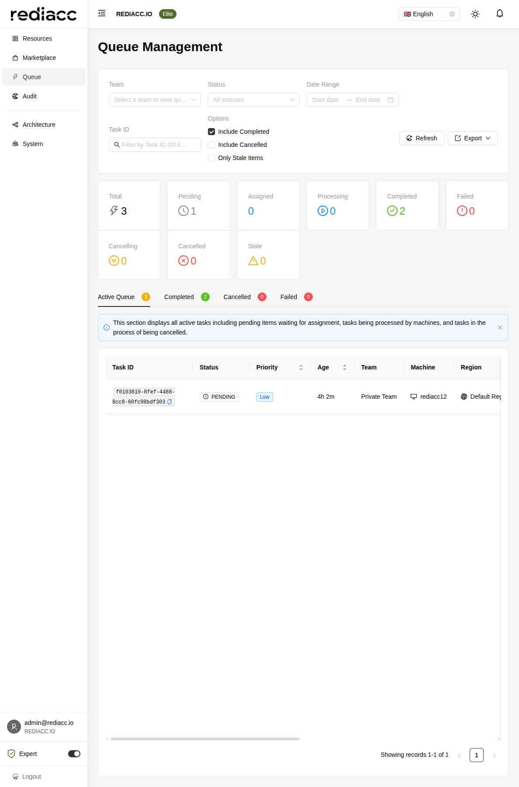

# Queue Management

The Queue Management interface provides comprehensive monitoring and control over distributed task execution across your infrastructure. This is where you track, manage, and troubleshoot all queued operations.

## Overview

The queue system is the heart of Rediacc's distributed task execution. Tasks are created, assigned to bridges, processed by machines, and tracked through their entire lifecycle.

## Queue Interface Components

### 1. Filtering Options

#### Team Selection
Filter queue items by team to focus on specific organizational units:
- Select from dropdown list
- View all teams (with appropriate permissions)
- Default shows current user's primary team

#### Status Filter
Filter by task status:
- All statuses (default)
- Pending
- Assigned
- Processing
- Completed
- Failed
- Cancelling
- Cancelled

#### Date Range
Filter tasks by creation date:
- Start date picker
- End date picker
- Defaults to last 7 days

#### Task ID Search
Direct lookup by Task ID (GUID format):
- Paste full or partial GUID
- Case-insensitive search
- Instant filtering

### 2. Display Options

#### Include Filters
- **Include Completed**: Show/hide completed tasks
- **Include Cancelled**: Show/hide cancelled tasks
- **Only Stale Items**: Show only tasks that haven't updated recently

#### Actions
- **Refresh**: Manual update of queue data
- **Export**: Download queue data in various formats
  - CSV for spreadsheet analysis
  - JSON for programmatic processing
  - PDF for reporting

### 3. Status Overview

Real-time counters showing task distribution:

- **Total**: All tasks in selected filter
- **Pending**: Waiting for bridge assignment
- **Assigned**: Claimed by bridge, not yet processing
- **Processing**: Currently executing
- **Completed**: Successfully finished
- **Failed**: Encountered errors
- **Cancelling**: Cancel request sent
- **Cancelled**: Successfully cancelled
- **Stale**: No updates for extended period

## Queue Tabs

### Active Queue
Shows all non-terminal tasks:
- Pending items awaiting assignment
- Tasks being processed
- Items in cancellation process

### Completed
Successfully finished tasks:
- Execution time
- Final output
- Success metrics

### Cancelled
Manually stopped tasks:
- Cancellation reason
- Who cancelled
- When cancelled

### Failed
Tasks that encountered errors:
- Error messages
- Retry attempts
- Failure diagnostics

## Task Details

Each queue item displays:

### Core Information
- **Task ID**: Unique GUID identifier with copy button
- **Status**: Visual icon and text status
- **Priority**: Highest, High, Normal, Low
- **Age**: Time since creation

### Assignment Details
- **Team**: Owning team
- **Machine**: Target execution machine
- **Region**: Geographic location
- **Bridge**: Processing bridge

### Execution Info
- **Response**: Has response data (Yes/No)
- **Retries**: Current attempt / Max retries
- **Created By**: User who created task
- **Created**: Exact timestamp

### Actions
- **Trace**: View detailed execution logs
- **Cancel**: Stop pending/processing tasks

## Task Lifecycle

### 1. Creation
Tasks are created through:
- Console UI actions
- CLI commands
- API calls
- Scheduled operations

### 2. Assignment
Bridge selection based on:
- Machine's preferred bridge
- Bridge availability
- Load balancing
- Region proximity

### 3. Processing
During execution:
- Bridge connects to machine
- Executes configured operations
- Streams output back
- Updates status in real-time

### 4. Completion
Terminal states:
- **Completed**: Successful execution
- **Failed**: Error encountered
- **Cancelled**: Manually stopped

## Priority Management

Task priorities determine processing order:

1. **Highest Priority**: Emergency tasks
   - System critical operations
   - Disaster recovery
   - Security responses

2. **High Priority**: Important operations
   - Production deployments
   - Backup operations
   - User-initiated tasks

3. **Normal Priority**: Standard operations
   - Routine maintenance
   - Scheduled tasks
   - Batch processing

4. **Low Priority**: Background tasks
   - Cleanup operations
   - Analytics gathering
   - Non-urgent updates

## Queue Actions

### Trace Functionality
View detailed task information:
- Complete execution logs
- Timing information
- Error details
- Vault data (if permitted)

### Cancel Operations
Cancel active tasks:
- Sends termination signal
- Graceful shutdown attempted
- Force kill if necessary
- Logs cancellation reason

### Bulk Operations
With appropriate permissions:
- Select multiple tasks
- Bulk cancel
- Bulk retry failed tasks
- Bulk export

## Monitoring Best Practices

### Daily Checks
1. Review failed tasks
2. Check for stale items
3. Monitor queue depth
4. Verify processing rates

### Performance Indicators

**Healthy Queue:**
- Most tasks completed
- Low pending count
- Few retries needed
- No stale items

**Queue Issues:**
- Growing pending count
- High failure rate
- Many stale items
- Excessive retries

### Common Patterns

**Bridge Offline:**
- Tasks remain pending
- No assignment occurring
- Check bridge status

**Machine Issues:**
- Tasks failing consistently
- Same machine affected
- Check connectivity

**Configuration Problems:**
- Immediate failures
- No processing time
- Review vault data

## Troubleshooting

### Task Stuck in Pending
1. Verify bridge is running
2. Check machine-bridge assignment
3. Review bridge capacity
4. Check for assignment errors

### High Failure Rate
1. Review error messages
2. Check machine connectivity
3. Verify credentials
4. Test operations manually

### Stale Tasks
1. Check bridge logs
2. Verify machine responsiveness
3. Review task configuration
4. Consider manual intervention

### Performance Issues
1. Monitor queue depth trends
2. Add additional bridges
3. Optimize task distribution
4. Review priority settings

## Export Options

### CSV Export
Includes:
- All visible columns
- Applied filters
- Formatted timestamps
- Ready for Excel

### JSON Export
Provides:
- Complete task data
- Nested structures
- Vault information (redacted)
- API-compatible format

### PDF Export
Contains:
- Summary statistics
- Task listing
- Applied filters
- Timestamp of export

## Advanced Features

### Queue Analytics
- Processing time trends
- Success rate metrics
- Bridge utilization
- Machine performance

### Automation
- Queue depth alerts
- Failure notifications
- Stale task warnings
- Performance thresholds

### Integration
- API access
- Webhook notifications
- External monitoring
- Custom dashboards