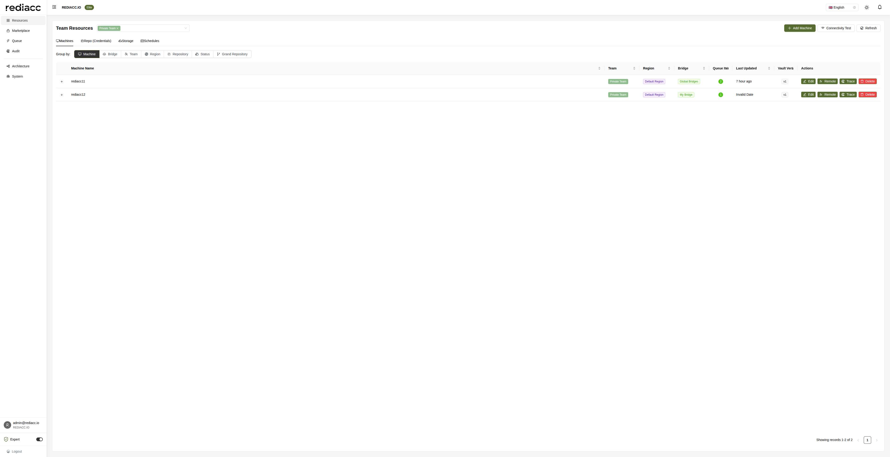

# Resource Management

The Resources section is the central hub for managing all infrastructure components in your Rediacc system. It provides comprehensive tools for organizing, monitoring, and configuring your distributed infrastructure.



## Overview

Resources in Rediacc are organized by teams, allowing for secure multi-tenant management. Each team has its own isolated set of resources that can be managed independently.

## Resource Types

### 1. Machines
Physical or virtual servers that execute tasks. Machines are the compute resources where your actual workloads run.

**Key Features:**
- SSH-based connectivity
- Queue item tracking
- Bridge assignment
- Vault configuration
- Remote access capabilities

[Learn more about Machine Management →](./machines.md)

### 2. Repo (Credentials)
Repository credentials for accessing code repositories and container registries.

**Supported Types:**
- Git repositories (GitHub, GitLab, Bitbucket)
- Docker registries
- Private npm registries
- Custom repository types

[Learn more about Repository Management →](./repositories.md)

### 3. Storage
External storage configurations for backup and data management.

**Storage Types:**
- AWS S3
- Azure Blob Storage
- Google Cloud Storage
- SFTP/FTP servers
- Local network storage

[Learn more about Storage Management →](./storage.md)

### 4. Schedules
Automated task scheduling for recurring operations.

**Schedule Features:**
- Cron-based scheduling
- Time zone support
- Dependency management
- Execution history

[Learn more about Schedule Management →](./schedules.md)

## Team Selection

At the top of the Resources page, you can select which team's resources to view and manage:

1. Click the team dropdown
2. Select the desired team
3. The view updates to show only that team's resources

## Resource Actions

### Common Actions

All resources support these standard actions:

- **Add**: Create new resources
- **Edit**: Modify existing configurations
- **Delete**: Remove resources (with confirmation)
- **Refresh**: Update the current view

### Machine-Specific Actions

For machines, additional actions are available:

- **Remote**: Direct SSH access to the machine
- **Trace**: View connection and execution logs
- **Connectivity Test**: Verify SSH connectivity

## Grouping and Filtering

The resource view supports multiple grouping options:

### Group By Options

1. **Machine**: Default view, one row per machine
2. **Bridge**: Group machines by their assigned bridge
3. **Team**: View all teams' resources (if permitted)
4. **Region**: Geographic grouping
5. **Repository**: Group by associated repositories
6. **Status**: Group by operational status
7. **Grand Repository**: Hierarchical repository view

### Grand Repository Grouping

The Grand Repository view provides a hierarchical organization of machines based on their repository relationships:

**Features:**
- Shows parent-child repository relationships
- Displays machines grouped by repository hierarchy
- Useful for microservices architectures
- Helps visualize deployment dependencies

**Use Cases:**
- Managing multi-repository applications
- Viewing service dependencies
- Coordinating deployments across related services
- Understanding infrastructure topology

**Example Hierarchy:**
```
└── main-app (grand repository)
    ├── frontend-service
    │   └── web-server-01, web-server-02
    ├── backend-service
    │   └── api-server-01, api-server-02
    └── database-service
        └── db-server-01, db-server-02
```

### Sorting

Click column headers to sort by:
- Machine Name
- Team
- Region
- Bridge
- Queue Items
- Last Updated
- Vault Version

## Resource Table

The main resource table displays:

### Machine Information
- **Machine Name**: Unique identifier
- **Team**: Owning team
- **Region**: Geographic location
- **Bridge**: Assigned queue processor

### Status Indicators
- **Queue Items**: Number with visual badge
  - Green badge: Active items
  - Number indicates pending items
- **Last Updated**: Time since last modification
- **Vault Version**: Configuration version

### Action Buttons
- **Edit**: Modify machine configuration
- **Remote**: SSH terminal access
- **Trace**: View execution logs
- **Delete**: Remove machine

## Adding Resources

### Add Machine Process

1. Click "Add Machine" button
2. Fill in required fields:
   - Machine name
   - IP address or hostname
   - SSH user
   - SSH port (default: 22)
   - Bridge assignment
3. Configure vault data:
   - SSH private key
   - Additional credentials
   - Custom configuration
4. Test connectivity
5. Save the machine

### Best Practices

1. **Naming Conventions**
   - Use descriptive names
   - Include environment (prod, dev, test)
   - Follow organizational standards

2. **Security**
   - Use SSH keys, not passwords
   - Implement IP whitelisting
   - Regular key rotation
   - Audit access logs

3. **Organization**
   - Group related machines
   - Use regions effectively
   - Assign appropriate bridges
   - Document configurations

## Connectivity Testing

The Connectivity Test feature helps diagnose connection issues:

1. Select machines to test
2. Click "Connectivity Test"
3. View results:
   - ✅ Success: Connection established
   - ❌ Failed: Connection error
   - 🕐 Timeout: No response
4. Review error details for troubleshooting

## Vault Management

Each resource has associated vault data for secure credential storage:

### Vault Versions
- Tracks configuration changes
- Allows rollback if needed
- Audit trail of modifications

### Vault Contents
- Encrypted credentials
- Connection parameters
- Custom configuration data
- Environment variables

## Performance Considerations

### Pagination
- Default: 10 items per page
- Adjustable page size
- Navigation controls at bottom

### Refresh Strategy
- Manual refresh available
- Auto-refresh for active operations
- Cached data for performance

## Troubleshooting

### Common Issues

**Machine not connecting:**
1. Verify IP/hostname
2. Check SSH credentials
3. Confirm network access
4. Review firewall rules

**Queue items stuck:**
1. Check bridge assignment
2. Verify bridge is running
3. Review machine logs
4. Test connectivity

**Vault errors:**
1. Verify encryption password
2. Check vault version
3. Review permissions
4. Contact administrator

### Getting Help

For resource-related issues:
1. Use Trace to view logs
2. Run Connectivity Test
3. Check Recent Activity
4. Contact support team