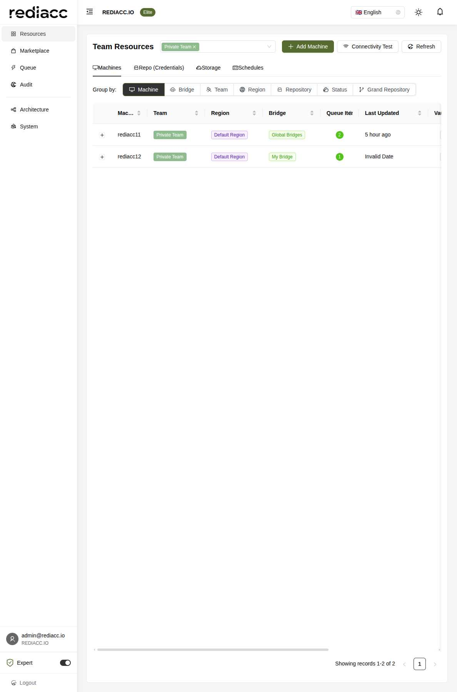
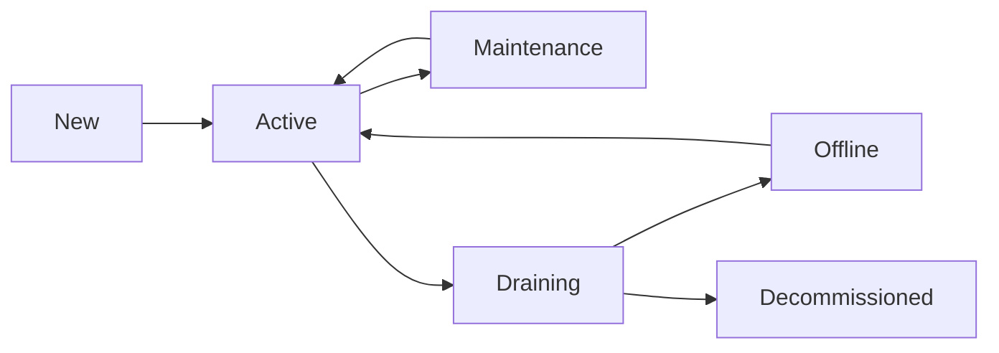

# Machine Management

The Machine Management interface is the central hub for configuring and managing all compute resources in your Rediacc infrastructure. Machines represent the actual servers where your applications, services, and tasks are executed.

## Overview

Machines in Rediacc are:
- Physical or virtual servers running Linux
- Docker-enabled hosts for containerized applications
- Execution targets for queued tasks
- Managed through secure SSH connections



## Machine Configuration

### Adding a New Machine

To add a machine to your infrastructure:

1. Navigate to **Resources** in the sidebar
2. Ensure you're on the **Machines** tab
3. Click **Add Machine**
4. Configure the machine details:

#### Basic Information
```yaml
Machine Name: prod-web-01
Team: Production
Region: Default Region
Bridge: Global Bridges

Description: Production web server for main application
Tags: 
  - production
  - web
  - critical
```

#### Connection Details
```yaml
Connection:
  IP Address: 10.0.1.100
  SSH Port: 22
  Username: rediacc
  
Datastore Path: /opt/rediacc/datastore
```

:::info
The datastore path is where Rediacc will store repositories, artifacts, and temporary files on the machine.
:::

#### Authentication

Rediacc uses SSH key authentication for secure machine access:

1. **Generate SSH Key Pair** (if needed):
   ```bash
   ssh-keygen -t ed25519 -C "rediacc-access"
   ```

2. **Add Public Key to Machine**:
   ```bash
   # On the target machine
   mkdir -p ~/.ssh
   echo "ssh-ed25519 AAAAC3..." >> ~/.ssh/authorized_keys
   chmod 600 ~/.ssh/authorized_keys
   ```

3. **Store Private Key in Vault**:
   - Enter the private key in the machine configuration
   - It will be encrypted and stored securely

### Machine Groups and Organization

#### Grouping Options

The interface provides multiple ways to organize machines:

- **By Machine**: Default view, alphabetical listing
- **By Bridge**: Group by assigned bridge
- **By Team**: Organize by team ownership
- **By Region**: Geographic or logical grouping
- **By Repository**: Machines using specific repos
- **By Status**: Active, inactive, or maintenance
- **By Grand Repository**: Advanced grouping

#### Filtering and Search

Use filters to find specific machines:
- Name search
- Team filter
- Region filter
- Status filter
- Tag-based filtering

## Machine Operations

### Connectivity Test

Before using a machine, verify connectivity:

1. Select machines to test
2. Click **Connectivity Test**
3. Review results:
   - SSH connection status
   - Authentication verification
   - Datastore accessibility
   - Docker availability

### Remote Access

Access machines directly from the console:

1. Click **Remote** button on a machine
2. Opens secure terminal session
3. Full SSH access with audit logging

:::caution
All remote sessions are logged for security and compliance.
:::

### Machine Monitoring

View real-time machine metrics:

- **Queue Items**: Active and pending tasks
- **Resource Usage**: CPU, memory, disk
- **Last Updated**: Last successful connection
- **Health Status**: Overall machine health

## Advanced Configuration

### Environment Variables

Set machine-specific environment variables:

```yaml
Environment:
  NODE_ENV: production
  APP_PORT: 3000
  DB_HOST: 10.0.2.50
  CACHE_ENABLED: true
```

### Resource Limits

Define resource constraints:

```yaml
Resources:
  CPU Limit: 4 cores
  Memory Limit: 8GB
  Disk Quota: 100GB
  Network Bandwidth: 100Mbps
```

### Docker Configuration

Configure Docker settings:

```yaml
Docker:
  Version: 20.10+
  Registry Mirrors:
    - https://mirror.company.com
  Insecure Registries:
    - registry.internal:5000
  Storage Driver: overlay2
  Log Driver: json-file
  Log Options:
    max-size: "10m"
    max-file: "3"
```

### Security Settings

Enhanced security configuration:

```yaml
Security:
  SSH:
    Allow Users: [rediacc, deploy]
    Deny Users: [root]
    Key Types: [ed25519, rsa-4096]
    
  Firewall:
    Allow From: [10.0.0.0/8]
    Block Ports: [25, 110, 143]
    
  SELinux: enforcing
  AppArmor: enabled
```

## Machine States and Lifecycle

### States

Machines can be in various states:

- **Active**: Normal operation, accepting tasks
- **Maintenance**: Temporarily unavailable
- **Draining**: Not accepting new tasks
- **Offline**: Connection lost
- **Decommissioned**: Removed from service

### State Transitions



### Maintenance Mode

Put a machine in maintenance:

1. Select the machine
2. Click **Actions** → **Maintenance Mode**
3. Set maintenance window
4. Optionally drain existing tasks

## Task Execution

### Queue Processing

Machines process tasks from the queue based on:

- **Priority**: Higher priority tasks first
- **Affinity**: Preferred machine assignments
- **Capacity**: Available resources
- **Capabilities**: Required features (GPU, specific software)

### Execution Environment

Each task runs in an isolated environment:

```yaml
Task Environment:
  Working Directory: /opt/rediacc/workdir/{task-id}
  User: rediacc-task
  Groups: [docker, rediacc]
  Umask: 0022
  Shell: /bin/bash
  
Isolation:
  Network: bridge
  PID Namespace: private
  Mount Namespace: private
  Resource Limits: enforced
```

## Troubleshooting

### Common Issues

#### Connection Failed

**Symptoms**: Cannot establish SSH connection

**Solutions**:
1. Verify IP address and port
2. Check firewall rules
3. Confirm SSH service is running
4. Validate network connectivity

#### Authentication Error

**Symptoms**: SSH key rejected

**Solutions**:
1. Verify private key format
2. Check public key on machine
3. Confirm user permissions
4. Review SSH configuration

#### Datastore Issues

**Symptoms**: Cannot access datastore path

**Solutions**:
1. Verify path exists
2. Check directory permissions
3. Ensure sufficient disk space
4. Confirm mount points

#### Docker Not Available

**Symptoms**: Docker commands fail

**Solutions**:
1. Install Docker on machine
2. Start Docker service
3. Add user to docker group
4. Verify Docker socket permissions

### Performance Optimization

#### SSH Connection Pooling

Enable connection reuse:
```yaml
SSH Config:
  ControlMaster: auto
  ControlPath: /tmp/rediacc-%r@%h:%p
  ControlPersist: 10m
  ServerAliveInterval: 60
```

#### Parallel Task Execution

Configure concurrent task limits:
```yaml
Execution:
  Max Parallel Tasks: 4
  Task Queue Size: 100
  Worker Threads: 8
```

## Best Practices

### Naming Conventions

Use descriptive, consistent names:
- Environment: `prod-`, `staging-`, `dev-`
- Purpose: `-web-`, `-db-`, `-worker-`
- Number: `-01`, `-02` for multiple instances

Examples:
- `prod-web-01`
- `staging-db-01`
- `dev-worker-03`

### Security

1. **Regular Updates**: Keep OS and packages updated
2. **Key Rotation**: Rotate SSH keys quarterly
3. **Audit Logs**: Review access logs regularly
4. **Minimal Access**: Grant only required permissions
5. **Network Isolation**: Use private networks where possible

### Monitoring

Set up comprehensive monitoring:

1. **System Metrics**:
   - CPU, Memory, Disk, Network
   - Process counts
   - System load

2. **Application Metrics**:
   - Container health
   - Service availability
   - Response times

3. **Security Metrics**:
   - Failed login attempts
   - Unusual network activity
   - File system changes

### Backup Strategy

Implement machine-level backups:

1. **System State**: OS configuration
2. **Application Data**: Persistent volumes
3. **Configuration**: Environment settings
4. **Logs**: Audit and application logs

## Integration with Other Components

### Bridge Assignment

Machines must be assigned to a bridge:
- Global bridges can access any region
- Regional bridges limited to specific regions
- Consider latency when assigning bridges

### Repository Deployment

Machines can pull from configured repositories:
- Automatic updates based on schedules
- Manual deployment triggers
- Rollback capabilities

### Storage Integration

Machines can access configured storage:
- Backup destinations
- Shared file systems
- Artifact repositories

## API Management

Manage machines programmatically:

```bash
# List machines
GET /api/StoredProcedure/GetMachines?teamName=Production

# Create machine
POST /api/StoredProcedure/CreateMachine
{
  "machineName": "prod-api-03",
  "teamName": "Production",
  "regionName": "Default Region",
  "bridgeName": "Global Bridges",
  "ipAddress": "10.0.1.103",
  "vaultData": {
    "sshPrivateKey": "encrypted:...",
    "username": "rediacc"
  }
}

# Update machine
POST /api/StoredProcedure/UpdateMachine
{
  "machineId": 123,
  "vaultData": {
    "sshPrivateKey": "encrypted:..."
  }
}

# Delete machine
POST /api/StoredProcedure/DeleteMachine
{
  "machineId": 123
}
```

## Related Documentation

- [Bridge Management](../system.md#bridges) - Configure bridges for machine access
- [Repository Management](./repositories.md) - Deploy code to machines
- [Storage Management](./storage.md) - Configure backup storage
- [Schedule Management](./schedules.md) - Automate machine tasks
- [Queue Management](../queue.md) - Understand task execution