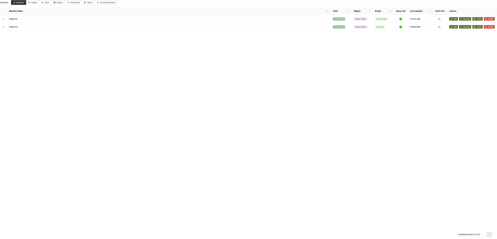
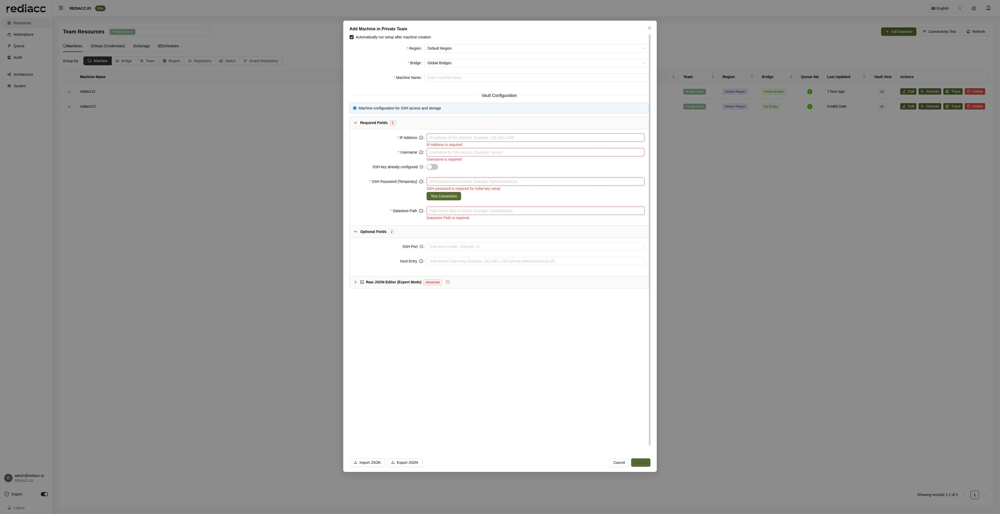
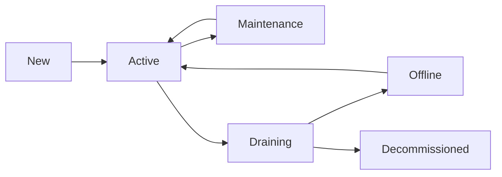

# Machine Management

The Machine Management interface is the central hub for configuring and managing all compute resources in your Rediacc infrastructure. Machines represent the actual servers where your applications, services, and tasks are executed.

## Overview

Machines in Rediacc are:
- Physical or virtual servers running Linux
- Docker-enabled hosts for containerized applications
- Execution targets for queued tasks
- Managed through secure SSH connections



## Interface Overview

### Machine Management Table

The machine management interface displays a comprehensive table with the following columns:

| Column | Description |
|--------|-------------|
| **Machine Name** | Unique identifier for the machine |
| **Team** | The team that owns this machine |
| **Region** | Geographic or logical region assignment |
| **Bridge** | The bridge managing this machine |
| **Queue Items** | Number of active tasks (shown as badge) |
| **Last Updated** | Last successful connection time |
| **Vault Version** | Configuration version (e.g., v1, v2) |
| **Actions** | Edit, Remote, Trace, Delete buttons |

### Header Controls

- **Team Selector**: Dropdown to switch between teams
- **Add Machine**: Create new machine configuration
- **Connectivity Test**: Verify SSH connectivity to selected machines
- **Refresh**: Update the machine list

## Machine Configuration

### Adding a New Machine

To add a machine to your infrastructure:

1. Navigate to **Resources** → **Machines**
2. Select your team from the dropdown
3. Click **Add Machine**
4. The configuration dialog appears with sections:



#### Basic Configuration

**Required Fields:**
- **Region**: Select from available regions
- **Bridge**: Choose the bridge to manage this machine
- **Machine Name**: Unique identifier (e.g., `prod-web-01`)

#### Vault Configuration

The vault stores sensitive SSH connection details:

**Required Fields (5):**
1. **IP Address**: Machine's IP address (IPv4 or IPv6)
2. **Username**: SSH username for connections
3. **SSH Password (Temporary)**: Initial password for key setup
4. **SSH Key Setup**: Toggle if key is already configured
5. **Datastore Path**: Directory for Rediacc data (e.g., `/opt/rediacc/datastore`)

**Optional Fields (2):**
1. **SSH Port**: Custom SSH port (default: 22)
2. **Host Entry**: Custom hostname mapping

#### Advanced Options

- **Automatically run setup after machine creation**: Checked by default - automatically configures SSH keys and validates connectivity
- **Raw JSON Editor (Expert Mode)**: Direct JSON configuration for advanced users
- **Import/Export JSON**: Save or load configurations for backup or templating

:::info
The datastore path is where Rediacc will store repositories, artifacts, and temporary files on the machine.
:::

#### Authentication Setup

Rediacc supports two authentication methods:

**1. Password-based Initial Setup** (Recommended):
- Enter temporary SSH password
- Rediacc automatically generates and configures SSH keys
- Password is used once and discarded
- Keys are stored encrypted in the vault

**2. Pre-configured SSH Key**:
- Toggle "SSH key already configured"
- Ensure your public key is on the machine
- The corresponding private key will be stored in the team vault

**Test Connection**: Click to verify SSH connectivity before saving

### Machine Groups and Organization

#### Grouping Options

The interface provides seven radio button grouping options for organizing your machine view. These are displayed horizontally below the team selector and allow you to restructure the table based on different organizational criteria:

##### 🖥️ Machine (Default)
- **Description**: Individual machine listing without grouping
- **Use Case**: Direct machine management and overview
- **Display**: Flat table showing all machines individually
- **Best For**: Quick access to specific machines

##### ☁️ Bridge
- **Description**: Groups machines by their assigned bridge processor
- **Use Case**: Understanding bridge workload distribution
- **Display**: Machines nested under bridge headers
- **Visual**: Shows bridge icon (🔌) with machine count
- **Best For**: Load balancing and bridge capacity planning

##### 👥 Team
- **Description**: Organizes machines by team ownership
- **Use Case**: Multi-team environments with isolated resources
- **Display**: Team headers with member machines below
- **Best For**: Team resource auditing and access control

##### 🌐 Region
- **Description**: Geographic or logical region grouping
- **Use Case**: Regional infrastructure management
- **Display**: Region headers (📍) with assigned machines
- **Best For**: Geographic distribution and compliance

##### 📦 Repository
- **Description**: Groups machines by deployed repositories
- **Use Case**: Application-centric infrastructure view
- **Display**: Repository names with associated machines
- **Best For**: Deployment tracking and application management

##### 📊 Status
- **Description**: Groups by machine operational status
- **Use Case**: Quickly identify healthy vs problematic machines
- **Display**: Status categories (Active, Inactive, Error)
- **Visual**: Color-coded status indicators
- **Best For**: Operational monitoring and troubleshooting

##### 🌳 Grand Repository (Expert Mode)
- **Description**: Advanced hierarchical repository grouping
- **Use Case**: Complex repository relationships and dependencies
- **Display**: Tree structure showing repository hierarchies
- **Availability**: Only visible when Expert Mode is enabled
- **Best For**: Advanced deployment scenarios with nested repositories

:::tip Expert Mode
The Grand Repository grouping option only appears when Expert Mode is enabled in the user menu. This provides advanced visualization for complex repository structures.
:::

#### Table Features

- **Sortable Columns**: Click column headers to sort
- **Expandable Rows**: View additional machine details
- **Pagination**: Navigate through large machine lists
- **Page Size**: Adjust items per page (10, 20, 50, 100)

## Machine Operations

### Connectivity Test

Before using a machine, verify connectivity:

1. Select machines to test
2. Click **Connectivity Test**
3. Review results:
   - SSH connection status
   - Authentication verification
   - Datastore accessibility
   - Docker availability

### Machine Actions

Each machine row provides quick action buttons:

#### ✏️ Edit
Modify machine configuration:
- Update connection details
- Change region or bridge assignment
- Modify vault credentials

#### 🔧 Remote
Access machines directly from the console:
- Opens secure web-based terminal
- Full SSH access with audit logging
- Session recording for compliance

#### 📊 Trace
View machine activity history:
- Connection logs
- Task execution history
- Configuration changes
- Error diagnostics

#### 🗑️ Delete
Remove machine from system:
- Requires confirmation
- Checks for active tasks
- Archives configuration

:::caution
All remote sessions and actions are logged for security and compliance.
:::

### Machine Monitoring

The interface displays real-time machine status:

#### Queue Items Badge
Shows active task count with color coding:
- 🟢 Green (0-5 tasks): Normal load
- 🟡 Yellow (6-10 tasks): Moderate load
- 🔴 Red (10+ tasks): High load

#### Last Updated
Connection status indicators:
- **Just now**: Active connection
- **X minutes/hours ago**: Time since last ping
- **Invalid Date**: Never connected

#### Vault Version
Configuration version tracking:
- Increments with each update
- Helps track configuration changes
- Enables rollback if needed

## Advanced Configuration

### Environment Variables

Set machine-specific environment variables:

```yaml
Environment:
  NODE_ENV: production
  APP_PORT: 3000
  DB_HOST: 10.0.2.50
  CACHE_ENABLED: true
```

### Resource Limits

Define resource constraints:

```yaml
Resources:
  CPU Limit: 4 cores
  Memory Limit: 8GB
  Disk Quota: 100GB
  Network Bandwidth: 100Mbps
```

### Docker Configuration

Configure Docker settings:

```yaml
Docker:
  Version: 20.10+
  Registry Mirrors:
    - https://mirror.company.com
  Insecure Registries:
    - registry.internal:5000
  Storage Driver: overlay2
  Log Driver: json-file
  Log Options:
    max-size: "10m"
    max-file: "3"
```

### Security Settings

Enhanced security configuration:

```yaml
Security:
  SSH:
    Allow Users: [rediacc, deploy]
    Deny Users: [root]
    Key Types: [ed25519, rsa-4096]
    
  Firewall:
    Allow From: [10.0.0.0/8]
    Block Ports: [25, 110, 143]
    
  SELinux: enforcing
  AppArmor: enabled
```

## Machine States and Lifecycle

### States

Machines can be in various states:

- **Active**: Normal operation, accepting tasks
- **Maintenance**: Temporarily unavailable
- **Draining**: Not accepting new tasks
- **Offline**: Connection lost
- **Decommissioned**: Removed from service

### State Transitions



### Maintenance Mode

Put a machine in maintenance:

1. Select the machine
2. Click **Actions** → **Maintenance Mode**
3. Set maintenance window
4. Optionally drain existing tasks

## Task Execution

### Queue Processing

Machines process tasks from the queue based on:

- **Priority**: Higher priority tasks first
- **Affinity**: Preferred machine assignments
- **Capacity**: Available resources
- **Capabilities**: Required features (GPU, specific software)

### Execution Environment

Each task runs in an isolated environment:

```yaml
Task Environment:
  Working Directory: /opt/rediacc/workdir/{task-id}
  User: rediacc-task
  Groups: [docker, rediacc]
  Umask: 0022
  Shell: /bin/bash
  
Isolation:
  Network: bridge
  PID Namespace: private
  Mount Namespace: private
  Resource Limits: enforced
```

## Troubleshooting

### Common Issues

#### Connection Failed

**Symptoms**: Cannot establish SSH connection

**Solutions**:
1. Verify IP address and port
2. Check firewall rules
3. Confirm SSH service is running
4. Validate network connectivity

#### Authentication Error

**Symptoms**: SSH key rejected

**Solutions**:
1. Verify private key format
2. Check public key on machine
3. Confirm user permissions
4. Review SSH configuration

#### Datastore Issues

**Symptoms**: Cannot access datastore path

**Solutions**:
1. Verify path exists
2. Check directory permissions
3. Ensure sufficient disk space
4. Confirm mount points

#### Docker Not Available

**Symptoms**: Docker commands fail

**Solutions**:
1. Install Docker on machine
2. Start Docker service
3. Add user to docker group
4. Verify Docker socket permissions

### Performance Optimization

#### SSH Connection Pooling

Enable connection reuse:
```yaml
SSH Config:
  ControlMaster: auto
  ControlPath: /tmp/rediacc-%r@%h:%p
  ControlPersist: 10m
  ServerAliveInterval: 60
```

#### Parallel Task Execution

Configure concurrent task limits:
```yaml
Execution:
  Max Parallel Tasks: 4
  Task Queue Size: 100
  Worker Threads: 8
```

## Best Practices

### Naming Conventions

Use descriptive, consistent names:
- Environment: `prod-`, `staging-`, `dev-`
- Purpose: `-web-`, `-db-`, `-worker-`
- Number: `-01`, `-02` for multiple instances

Examples:
- `prod-web-01`
- `staging-db-01`
- `dev-worker-03`

### Security

1. **Regular Updates**: Keep OS and packages updated
2. **Key Rotation**: Rotate SSH keys quarterly
3. **Audit Logs**: Review access logs regularly
4. **Minimal Access**: Grant only required permissions
5. **Network Isolation**: Use private networks where possible

### Monitoring

Set up comprehensive monitoring:

1. **System Metrics**:
   - CPU, Memory, Disk, Network
   - Process counts
   - System load

2. **Application Metrics**:
   - Container health
   - Service availability
   - Response times

3. **Security Metrics**:
   - Failed login attempts
   - Unusual network activity
   - File system changes

### Backup Strategy

Implement machine-level backups:

1. **System State**: OS configuration
2. **Application Data**: Persistent volumes
3. **Configuration**: Environment settings
4. **Logs**: Audit and application logs

## Integration with Other Components

### Bridge Assignment

Machines must be assigned to a bridge:
- Global bridges can access any region
- Regional bridges limited to specific regions
- Consider latency when assigning bridges

### Repository Deployment

Machines can pull from configured repositories:
- Automatic updates based on schedules
- Manual deployment triggers
- Rollback capabilities

### Storage Integration

Machines can access configured storage:
- Backup destinations
- Shared file systems
- Artifact repositories

## API Management

Manage machines programmatically:

```bash
# List machines
GET /api/StoredProcedure/GetMachines?teamName=Production

# Create machine
POST /api/StoredProcedure/CreateMachine
{
  "machineName": "prod-api-03",
  "teamName": "Production",
  "regionName": "Default Region",
  "bridgeName": "Global Bridges",
  "ipAddress": "10.0.1.103",
  "vaultData": {
    "sshPrivateKey": "encrypted:...",
    "username": "rediacc"
  }
}

# Update machine
POST /api/StoredProcedure/UpdateMachine
{
  "machineId": 123,
  "vaultData": {
    "sshPrivateKey": "encrypted:..."
  }
}

# Delete machine
POST /api/StoredProcedure/DeleteMachine
{
  "machineId": 123
}
```

## Related Documentation

- [Bridge Management](../system.md#bridges) - Configure bridges for machine access
- [Repository Management](./repositories.md) - Deploy code to machines
- [Storage Management](./storage.md) - Configure backup storage
- [Schedule Management](./schedules.md) - Automate machine tasks
- [Queue Management](../queue.md) - Understand task execution