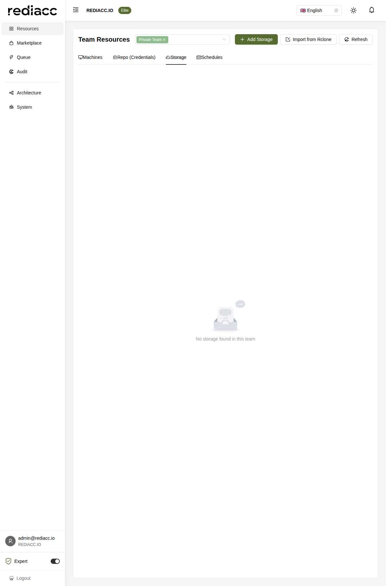

# Storage Management

The Storage Management interface enables you to configure and manage various storage backends for backups, artifacts, and data persistence across your Rediacc infrastructure.

## Overview

Storage configurations in Rediacc provide secure, scalable solutions for:
- Application backups
- Database snapshots
- File synchronization
- Artifact storage
- Log aggregation



## Supported Storage Types

### Cloud Storage

#### Amazon S3
- **Regions**: All AWS regions supported
- **Features**: Versioning, lifecycle policies, encryption
- **Use Cases**: Large-scale backups, static assets, archives

#### Azure Blob Storage
- **Account Types**: General-purpose v2, Blob storage
- **Tiers**: Hot, Cool, Archive
- **Features**: Immutable storage, soft delete, snapshots

#### Google Cloud Storage
- **Classes**: Standard, Nearline, Coldline, Archive
- **Features**: Object lifecycle, versioning, retention policies
- **Integration**: Works with GCP services

### Network Storage

#### SFTP/FTP
- **Protocols**: SFTP (recommended), FTPS, FTP
- **Authentication**: Password, SSH keys
- **Use Cases**: Legacy system integration, simple file transfers

#### SMB/CIFS
- **Versions**: SMB 2.0, 3.0, 3.1.1
- **Authentication**: Domain, workgroup, standalone
- **Features**: Windows integration, Active Directory support

#### NFS
- **Versions**: NFSv3, NFSv4
- **Features**: Unix permissions, Kerberos authentication
- **Use Cases**: Linux/Unix environments, shared storage

### Object Storage

#### MinIO
- **Deployment**: Self-hosted S3-compatible storage
- **Features**: Distributed mode, erasure coding
- **Use Cases**: On-premises S3 alternative

#### Ceph
- **Interfaces**: S3, Swift, native
- **Features**: Scalable, self-healing
- **Use Cases**: Large-scale private cloud

## Creating Storage Configuration

To add a new storage configuration:

1. Navigate to **Resources** → **Storage**
2. Click **Add Storage**
3. Select storage type and configure:

### S3 Configuration Example

```yaml
Storage Name: production-backups
Type: S3
Region: us-east-1

Configuration:
  Bucket: company-backups
  Path Prefix: /rediacc/prod/
  
Credentials:
  Access Key ID: AKIA...
  Secret Access Key: [encrypted]
  
Advanced:
  Storage Class: STANDARD_IA
  Encryption: AES256
  Versioning: Enabled
  Lifecycle: 90 days to GLACIER
```

### Azure Blob Configuration

```yaml
Storage Name: azure-archives
Type: Azure Blob

Configuration:
  Account Name: companyarchives
  Container: rediacc-backups
  
Credentials:
  Connection String: [encrypted]
  SAS Token: [optional]
  
Advanced:
  Access Tier: Cool
  Redundancy: GRS
  Soft Delete: 30 days
```

### SFTP Configuration

```yaml
Storage Name: legacy-backup
Type: SFTP

Configuration:
  Host: backup.company.com
  Port: 22
  Path: /mnt/backups/rediacc
  
Credentials:
  Username: rediacc-backup
  Authentication: SSH Key
  Private Key: [encrypted]
  
Advanced:
  Compression: Enabled
  Bandwidth Limit: 10MB/s
```

## Import from Rclone

Rediacc supports importing existing Rclone configurations:

1. Click **Import from Rclone**
2. Paste your `rclone.conf` content
3. Select configurations to import
4. Map to Rediacc teams
5. Review and confirm import

Example Rclone configuration:
```ini
[company-s3]
type = s3
provider = AWS
access_key_id = AKIA...
secret_access_key = ...
region = us-west-2
acl = private

[azure-backup]
type = azureblob
account = companybackup
key = ...
```

## Storage Operations

### Testing Connectivity

Before using storage, test the connection:

1. Select the storage configuration
2. Click **Test Connection**
3. Review test results:
   - Connectivity check
   - Permission validation
   - Available space
   - Write/read test

### Storage Metrics

Monitor storage usage and performance:

- **Space Used**: Current consumption
- **Available Space**: Remaining capacity
- **Object Count**: Number of stored items
- **Bandwidth**: Upload/download speeds
- **API Calls**: Request metrics (for cloud storage)

### Access Control

Configure access permissions:

1. **Read-Only**: For backup verification
2. **Write-Only**: For backup operations only
3. **Full Access**: For maintenance operations

## Backup Strategies

### Retention Policies

Define how long to keep backups:

```yaml
Retention:
  Daily: 7 days
  Weekly: 4 weeks
  Monthly: 12 months
  Yearly: 7 years
  
Cleanup:
  Auto Delete: Enabled
  Grace Period: 7 days
```

### Backup Rotation

Implement grandfather-father-son (GFS) rotation:

1. **Daily Backups**: Kept for 1 week
2. **Weekly Backups**: Kept for 1 month
3. **Monthly Backups**: Kept for 1 year

### Incremental Backups

Configure efficient incremental backups:

```yaml
Backup Type: Incremental
Base: Weekly full backup
Increments: Daily
Compression: gzip
Encryption: AES-256
```

## Security Considerations

### Encryption

All storage configurations support encryption:

1. **At Rest**: Data encrypted on storage
2. **In Transit**: TLS/SSL for transfers
3. **Client-Side**: Encrypt before upload

### Access Keys

Best practices for credentials:

1. Use IAM roles when possible
2. Rotate access keys regularly
3. Limit permissions to minimum required
4. Use SAS tokens for Azure
5. Enable MFA for critical storage

### Audit Logging

Enable comprehensive logging:

- Access attempts
- Data modifications
- Permission changes
- Failed operations

## Cost Optimization

### Storage Classes

Choose appropriate storage classes:

| Use Case | AWS S3 | Azure | GCS |
|----------|--------|-------|-----|
| Frequent Access | STANDARD | Hot | Standard |
| Infrequent Access | STANDARD_IA | Cool | Nearline |
| Archive | GLACIER | Archive | Coldline |
| Deep Archive | DEEP_ARCHIVE | - | Archive |

### Lifecycle Policies

Automate cost optimization:

```yaml
Lifecycle Rules:
  - Name: Archive old backups
    Conditions:
      Age: 30 days
    Actions:
      Transition: GLACIER
      
  - Name: Delete old logs
    Conditions:
      Age: 90 days
      Tag: log-type=debug
    Actions:
      Delete: true
```

## Troubleshooting

### Common Issues

#### Connection Failures
```
Error: Unable to connect to storage endpoint
```
**Solutions**:
- Verify endpoint URL
- Check network connectivity
- Review firewall rules
- Validate credentials

#### Permission Denied
```
Error: Access denied to bucket/container
```
**Solutions**:
- Check IAM/RBAC permissions
- Verify bucket policies
- Confirm access key permissions
- Review SAS token expiration

#### Quota Exceeded
```
Error: Storage quota exceeded
```
**Solutions**:
- Review storage metrics
- Implement retention policies
- Archive old data
- Upgrade storage plan

### Performance Issues

1. **Slow Uploads**
   - Check bandwidth limits
   - Enable multipart uploads
   - Use compression
   - Review network path

2. **High Latency**
   - Choose closer regions
   - Enable CDN/edge caching
   - Optimize request patterns
   - Consider storage class

## API Integration

Manage storage via REST API:

```bash
# List storage configurations
GET /api/StoredProcedure/GetStorageList?teamName=Default

# Create storage
POST /api/StoredProcedure/CreateStorage
{
  "storageName": "prod-backups",
  "storageType": "S3",
  "teamName": "Default",
  "configuration": {
    "bucket": "company-backups",
    "region": "us-east-1"
  },
  "vaultData": {
    "accessKey": "encrypted:...",
    "secretKey": "encrypted:..."
  }
}

# Test storage connection
POST /api/StoredProcedure/TestStorage
{
  "storageId": 123
}
```

## Best Practices

### Naming Conventions

Use descriptive, consistent names:
- `prod-db-backups-s3`
- `staging-artifacts-azure`
- `logs-archive-glacier`

### Redundancy

Implement multiple storage backends:
1. Primary: Fast, accessible storage
2. Secondary: Different provider/region
3. Archive: Long-term, low-cost storage

### Monitoring

Set up alerts for:
- Storage capacity warnings
- Failed backup operations
- Unusual access patterns
- Cost threshold breaches

## Related Documentation

- [Machine Management](./machines.md) - Storage usage by machines
- [Repository Management](./repositories.md) - Artifact storage
- [Schedule Management](./schedules.md) - Automated backups
- [System Settings](../system.md) - Storage quotas and limits