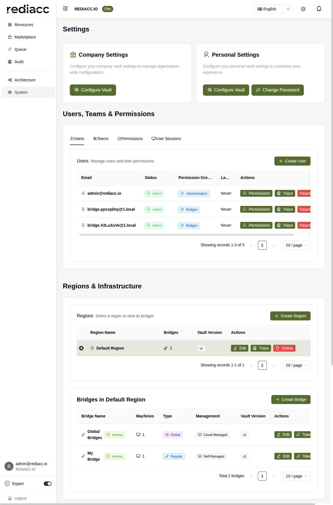
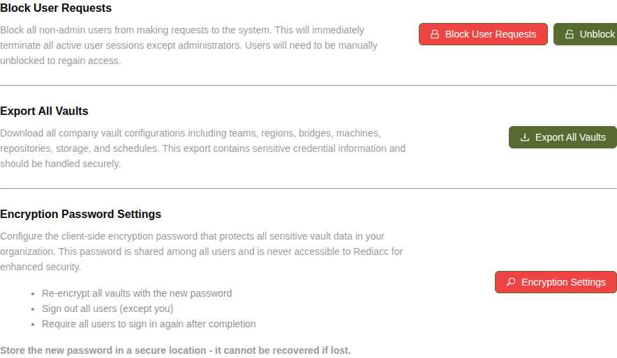

# System Settings

The System Settings page is the central hub for managing your Rediacc installation, including user management, infrastructure configuration, and critical system operations.

## Overview

System Settings provides administrators with comprehensive control over:
- Company and personal configurations
- User management and permissions
- Team organization
- Infrastructure (regions and bridges)
- Security settings
- Critical system operations

## Settings Sections

### 1. Company Settings

Configure organization-wide settings that affect all users and operations:

- **Vault Configuration**: Manage company-wide vault settings
- **Global Parameters**: Set system-wide defaults
- **Integration Settings**: Configure external service connections
- **Compliance Options**: Enable regulatory compliance features

**Key Actions:**
- Configure Vault: Access and modify company vault data

### 2. Personal Settings

Individual user preferences and security settings:

- **Personal Vault**: User-specific configurations
- **Password Management**: Change your account password
- **Preferences**: UI and notification settings
- **API Tokens**: Personal access tokens

**Key Actions:**
- Configure Vault: Manage personal vault data
- Change Password: Update account credentials

## Users, Teams & Permissions

### Users Tab

Comprehensive user management interface displaying:

**User Information:**
- Email address with user icon
- Status (Active/Inactive)
- Permission group assignment
- Last active timestamp

**User Actions:**
- **Create User**: Add new users to the system
- **Permissions**: Manage individual user permissions
- **Trace**: View user activity history
- **Deactivate**: Disable user access

**Permission Groups:**
- **Administrators**: Full system access
- **Bridges**: Automated bridge user accounts
- **Operators**: Limited administrative access
- **Viewers**: Read-only access

### Teams Tab

Organize users into functional teams:

**Team Management:**
- Create new teams
- Assign team members
- Set team permissions
- Configure team vaults

**Team Features:**
- Isolated resource ownership
- Team-specific credentials
- Collaborative workflows
- Access boundaries

### Permissions Tab

Fine-grained permission control:

**Permission Types:**
- Resource permissions
- Action permissions
- API access rights
- Feature toggles

**Management Options:**
- Create custom permission groups
- Assign permissions to users/teams
- Audit permission usage
- Bulk permission updates

### User Sessions Tab

Monitor active user sessions:

**Session Information:**
- Active sessions list
- Session duration
- IP addresses
- Session tokens

**Session Actions:**
- Terminate sessions
- Force re-authentication
- View session history
- Export session data

## Regions & Infrastructure

### Regions Management

Geographic and logical infrastructure zones:

**Region Configuration:**
- **Region Name**: Descriptive identifier
- **Bridges**: Number of bridges in region
- **Vault Version**: Configuration version tracking

**Region Actions:**
- **Create Region**: Add new geographic zones
- **Edit**: Modify region settings
- **Trace**: View region activity
- **Delete**: Remove regions (with confirmation)

### Bridges Management

Queue processors within selected region:

**Bridge Information:**
- **Bridge Name**: Unique identifier
- **Access Status**: Connection health
- **Machines**: Connected machine count
- **Type**: Global or Regular
- **Management**: Cloud-Managed or Self-Managed

**Bridge Types:**
- **Global Bridges**: Shared across teams
- **Regular Bridges**: Team-specific processors

**Bridge Actions:**
- **Create Bridge**: Add new queue processor
- **Edit**: Modify bridge configuration
- **Token**: View/reset API token
- **Reset Auth**: Force re-authentication
- **Trace**: View bridge logs
- **Delete**: Remove bridge

## Danger Zone

Critical operations that affect system-wide functionality:

### 1. Block User Requests

Emergency access control:

**Purpose:**
- Immediately block all non-admin users
- Terminate active user sessions
- Prevent new logins
- Maintain admin access only

**Use Cases:**
- Security incidents
- System maintenance
- Emergency lockdown
- Compliance requirements

**Recovery:**
- Use "Unblock User Requests" to restore access
- Users must re-authenticate
- Sessions are not restored

### 2. Export All Vaults

Complete system backup:

**Includes:**
- All team vaults
- Region configurations
- Bridge settings
- Machine credentials
- Repository access
- Storage configurations
- Schedule definitions

**Security Warning:**
- Contains sensitive credentials
- Should be encrypted
- Store securely
- Limit access

### 3. Encryption Password Settings

Master encryption configuration:

**Features:**
- Set organization-wide encryption password
- Re-encrypt all vaults
- Force user re-authentication
- Cannot be recovered if lost

**Process:**
1. Enter new encryption password
2. System re-encrypts all vaults
3. All users logged out (except current)
4. Users must re-login with new password

**Critical Notes:**
- Store password securely
- Cannot be recovered
- Affects all users immediately
- Plan communication strategy

## Best Practices

### User Management
1. Regular access reviews
2. Principle of least privilege
3. Deactivate unused accounts
4. Monitor last active times

### Infrastructure Planning
1. Logical region grouping
2. Bridge redundancy
3. Geographic distribution
4. Capacity planning

### Security Operations
1. Regular password rotations
2. Audit permission changes
3. Monitor session activity
4. Document critical operations

### Maintenance Windows
1. Announce in advance
2. Use block user requests
3. Perform operations
4. Restore access promptly

## Troubleshooting

### Common Issues

**Cannot create user:**
- Check license limits
- Verify email uniqueness
- Ensure proper permissions
- Check email format

**Bridge not connecting:**
- Verify token validity
- Check network access
- Review firewall rules
- Confirm region assignment

**Permission denied:**
- Verify user permissions
- Check team membership
- Review permission inheritance
- Confirm session validity

**Vault export fails:**
- Check disk space
- Verify permissions
- Review system logs
- Try smaller exports

### Emergency Procedures

**System Lockdown:**
1. Access System Settings
2. Navigate to Danger Zone
3. Click "Block User Requests"
4. Confirm action
5. Document reason

**Recovery Process:**
1. Resolve underlying issue
2. Click "Unblock User Requests"
3. Notify users
4. Monitor re-authentication
5. Review audit logs

## Integration Points

### API Access
- User management endpoints
- Permission queries
- Session management
- Infrastructure APIs

### Audit Integration
- All actions logged
- Searchable audit trail
- Compliance reporting
- Activity monitoring

### External Systems
- LDAP/AD integration
- SSO configuration
- Webhook notifications
- SIEM integration