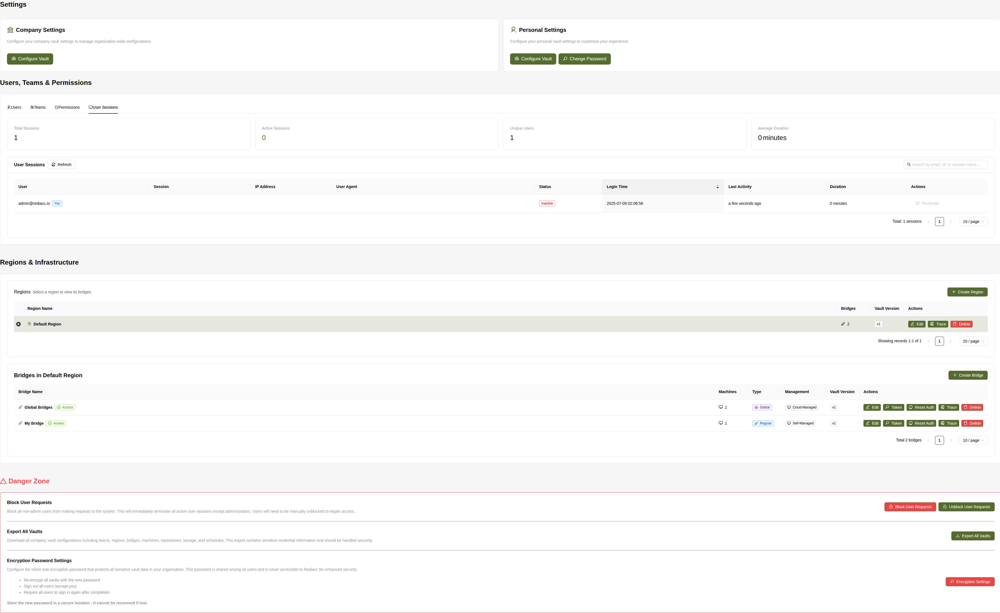

# System Settings

The System Settings page is the central hub for managing your Rediacc installation, including user management, infrastructure configuration, and critical system operations.

## Overview

System Settings provides administrators with comprehensive control over:
- Company and personal configurations
- User management and permissions
- Team organization
- Infrastructure (regions and bridges)
- Security settings
- Critical system operations

## Settings Sections

### 1. Company Settings

**Icon**: 🏦 Bank

**Description**: Configure your company vault settings to manage organization-wide configurations.

**Key Actions:**
- ⚙️ **Configure Vault**: Access and modify company vault data including:
  - Global configurations
  - Default settings
  - Integration parameters
  - Compliance options

### 2. Personal Settings

**Icon**: 👤 User

**Description**: Configure your personal vault settings to customize your experience.

**Key Actions:**
- ⚙️ **Configure Vault**: Manage personal preferences and settings
- 🔑 **Change Password**: Update your account password

## Users, Teams & Permissions

### Users Tab

**Header**: "Users - Manage users and their permissions"

**Table Columns:**
| Column | Description |
|--------|-------------|
| **Email** | User email with 👤 icon |
| **Status** | ✅ Active or ❌ Inactive |
| **Permission Group** | 🔒 Group assignment (e.g., Administrators, Bridges) |
| **Last Active** | Last login time or "Never" |
| **Actions** | Management buttons |

**User Actions:**
- ➕ **Create User**: Add new users to the system
- 🔒 **Permissions**: Manage individual user permissions
- 📊 **Trace**: View user activity history
- **Deactivate**: Disable user access (red button)

**Permission Groups Observed:**
- 🔒 **Administrators**: Full system access (e.g., admin@rediacc.io)
- 🔒 **Bridges**: Automated bridge user accounts (e.g., bridge.ppxxpDrp@1.local)

**Table Features:**
- Pagination controls
- Page size selector (10, 20, 50, 100)
- Shows total record count

### Teams Tab

**Header**: "Teams - Manage teams and their members"

**Table Columns:**
| Column | Description |
|--------|-------------|
| **Team Name** | Team identifier with 👥 icon |
| **Members** | User count with 👤 icon |
| **Machines** | Machine count with 🖥️ icon |
| **Repositories** | Repository count with 🗜️ icon |
| **Storage** | Storage count with ☁️ icon |
| **Schedules** | Schedule count with 📅 icon |
| **Vault Version** | Configuration version (e.g., v14) |
| **Actions** | Management buttons |

**Team Actions:**
- ➕ **Create Team**: Add new team
- ✏️ **Edit**: Modify team configuration
- 👤 **Members**: Manage team membership
- 📊 **Trace**: View team activity
- 🗑️ **Delete**: Remove team

**Example Team:**
- **Private Team**: 1 member, 2 machines, 1 repository, 0 storage, 0 schedules

### Permissions Tab

The Permissions tab provides comprehensive management of permission groups and their assignments across the system.

**Header**: "Permission Groups - Manage permission groups and their assignments"

**Table Columns:**
| Column | Description |
|--------|-------------|
| **Group Name** | Permission group identifier with 🔒 icon |
| **Users** | Number of users in group with 👤 icon |
| **Permissions** | Number of assigned permissions with 🔑 icon |
| **Actions** | Management buttons |

**Permission Groups:**

1. **🔒 Administrators**
   - Users: 1 (admin users)
   - Permissions: 0 (full system access implied)
   - Description: Complete system control

2. **🔒 Bridges**
   - Users: 2 (automated bridge accounts)
   - Permissions: 5
   - Description: Queue processing and machine access

3. **🔒 Users**
   - Users: 0
   - Permissions: 45 (displayed as "4 5" in badges)
   - Description: Standard user permissions

**Group Actions:**
- ➕ **Create Group**: Add new permission group
- 🔑 **Permissions**: View/edit assigned permissions
- 👤 **Assign User**: Add users to the group
- 📊 **Trace**: View group activity history
- 🗑️ **Delete**: Remove permission group

**Key Features:**
- Predefined system groups (Administrators, Bridges, Users)
- Custom group creation capability
- Granular permission assignment
- User-group association management
- Activity tracking for compliance

### User Sessions Tab

The User Sessions tab provides comprehensive monitoring and management of all user sessions across the system. For detailed documentation, see [User Sessions Guide](./user-sessions.md).

**Header**: "User Sessions - Monitor and manage active user sessions"

**Session Statistics Cards:**
Top row displays four key metrics in card format:

1. **Total Sessions**: All sessions (active and inactive)
2. **Active Sessions**: Currently connected users (green color #3f8600)
3. **Unique Users**: Distinct users with sessions
4. **Average Duration**: Mean session length in minutes

**Session Management Interface:**
- **Title**: "User Sessions" with 🔄 Refresh button
- **Search**: Filter by email, IP address, or session name
- **Table**: Comprehensive session listing

**Table Columns:**
| Column | Description |
|--------|-------------|
| **User** | Email with blue "Current Session" tag for your session |
| **Session Name** | Session identifier |
| **IP Address** | Source connection IP |
| **User Agent** | Browser/OS information (truncated) |
| **Status** | ✅ Active (green) or ❌ Inactive (red) |
| **Created At** | Login timestamp (YYYY-MM-DD HH:mm:ss) |
| **Last Activity** | Relative time (e.g., "5 minutes ago") |
| **Duration** | Session length in minutes |
| **Actions** | Terminate button (red, with confirmation) |

**Key Features:**
- Real-time session tracking via token rotation
- Case-insensitive search across multiple fields
- Sortable by creation date (newest first by default)
- Pagination with adjustable page size (10/20/50/100)
- Horizontal scroll for full table visibility (1500px)
- Confirmation dialog for session termination
- Special warning when terminating own session
- Loading states for refresh operations

**Security Considerations:**
- Only administrators can access this tab
- All termination actions are audit logged
- Sessions use rotating tokens for security
- IP tracking for security analysis

## Regions & Infrastructure

### Regions Management

**Header**: "Regions - Select a region to view its bridges"

**Table Columns:**
| Column | Description |
|--------|-------------|
| **Selection** | Radio button for region selection |
| **Region Name** | Region identifier with 🌍 icon |
| **Bridges** | Bridge count with 🌉 icon |
| **Vault Version** | Configuration version |
| **Actions** | Management buttons |

**Region Actions:**
- ➕ **Create Region**: Add new geographic/logical zone
- ✏️ **Edit**: Modify region settings
- 📊 **Trace**: View region activity logs
- 🗑️ **Delete**: Remove region (requires confirmation)

**Example Region:**
- **Default Region**: 2 bridges, v1

### Bridges Management

**Header**: "Bridges in [Selected Region]"

**Table Columns:**
| Column | Description |
|--------|-------------|
| **Bridge Name** | Bridge identifier with 🌉 icon and ✅ Access status |
| **Machines** | Connected machines with 🖥️ icon |
| **Type** | ☁️ Global or 🌉 Regular |
| **Management** | 🖥️ Cloud-Managed or Self-Managed |
| **Vault Version** | Configuration version |
| **Actions** | Management buttons |

**Bridge Types:**
- **☁️ Global**: Shared across all teams
- **🌉 Regular**: Team-specific processors

**Management Types:**
- **🖥️ Cloud-Managed**: Managed by Rediacc
- **🖥️ Self-Managed**: User-managed infrastructure

**Bridge Actions:**
- ➕ **Create Bridge**: Add new queue processor
- ✏️ **Edit**: Modify bridge configuration
- 🔑 **Token**: View/reset API authentication token
- 🔄 **Reset Auth**: Force re-authentication
- 📊 **Trace**: View bridge activity logs
- 🗑️ **Delete**: Remove bridge

**Example Bridges:**
- **Global Bridges**: 1 machine, Global type, Cloud-Managed
- **My Bridge**: 1 machine, Regular type, Self-Managed

## ⚠️ Danger Zone

Critical operations that affect system-wide functionality. This section is highlighted with a warning icon and contains high-impact system operations.

### 1. Block User Requests

**Description**: Block all non-admin users from making requests to the system. This will immediately terminate all active user sessions except administrators. Users will need to be manually unblocked to regain access.

**Actions Available:**
- 🔒 **Block User Requests**: Activate emergency lockdown
- 🔓 **Unblock User Requests**: Restore normal access

**Impact:**
- Immediately blocks all non-admin users
- Terminates active user sessions
- Prevents new logins
- Maintains admin access only

**Use Cases:**
- Security incidents
- System maintenance
- Emergency lockdown
- Compliance requirements

### 2. Export All Vaults

**Description**: Download all company vault configurations including teams, regions, bridges, machines, repositories, storage, and schedules. This export contains sensitive credential information and should be handled securely.

**Action:**
- 📥 **Export All Vaults**: Download complete system configuration

**Includes:**
- All team vaults and credentials
- Region configurations
- Bridge settings and tokens
- Machine SSH credentials
- Repository access keys
- Storage configurations
- Schedule definitions

**⚠️ Security Warning:**
- Contains unencrypted sensitive credentials
- Should be immediately encrypted after download
- Store in secure location only
- Limit access to authorized personnel

### 3. Encryption Password Settings

**Description**: Configure the client-side encryption password that protects all sensitive vault data in your organization. This password is shared among all users and is never accessible to Rediacc for enhanced security.

**Action:**
- 🔑 **Encryption Settings**: Configure master encryption password

**Process Effects:**
- Re-encrypt all vaults with the new password
- Sign out all users (except you)
- Require all users to sign in again after completion

**⚠️ Critical Warning:**
**Store the new password in a secure location - it cannot be recovered if lost.**

**Implementation Steps:**
1. Click Encryption Settings
2. Enter new master password
3. Confirm password change
4. System re-encrypts all vaults
5. All other users are logged out
6. Share new password securely with users

**Important Considerations:**
- Plan communication strategy before changing
- Ensure all users are notified
- Have secure password distribution method
- Consider timing to minimize disruption

## Best Practices

### User Management
1. Regular access reviews
2. Principle of least privilege
3. Deactivate unused accounts
4. Monitor last active times

### Infrastructure Planning
1. Logical region grouping
2. Bridge redundancy
3. Geographic distribution
4. Capacity planning

### Security Operations
1. Regular password rotations
2. Audit permission changes
3. Monitor session activity
4. Document critical operations

### Maintenance Windows
1. Announce in advance
2. Use block user requests
3. Perform operations
4. Restore access promptly

## Troubleshooting

### Common Issues

**Cannot create user:**
- Check license limits
- Verify email uniqueness
- Ensure proper permissions
- Check email format

**Bridge not connecting:**
- Verify token validity
- Check network access
- Review firewall rules
- Confirm region assignment

**Permission denied:**
- Verify user permissions
- Check team membership
- Review permission inheritance
- Confirm session validity

**Vault export fails:**
- Check disk space
- Verify permissions
- Review system logs
- Try smaller exports

### Emergency Procedures

**System Lockdown:**
1. Access System Settings
2. Navigate to Danger Zone
3. Click "Block User Requests"
4. Confirm action
5. Document reason

**Recovery Process:**
1. Resolve underlying issue
2. Click "Unblock User Requests"
3. Notify users
4. Monitor re-authentication
5. Review audit logs

## Integration Points

### API Access
- User management endpoints
- Permission queries
- Session management
- Infrastructure APIs

### Audit Integration
- All actions logged
- Searchable audit trail
- Compliance reporting
- Activity monitoring

### External Systems
- LDAP/AD integration
- SSO configuration
- Webhook notifications
- SIEM integration